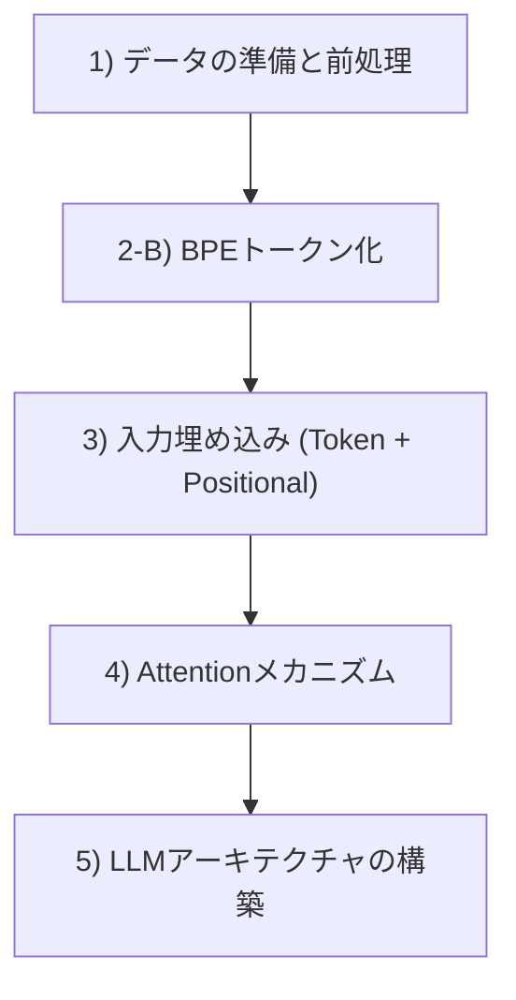

# PyTorchによるLLMスクラッチ自作 (pytorch-llm)

本ディレクトリは、書籍『つくりながら学ぶ！LLM自作入門』の設計思想に基づき、PyTorchを用いて大規模言語モデル（LLM）を一から手書きで実装・学習するためのワークスペースです。

---

## 🗺️ LLM構築の学習ロードマップ

学習と実装は、以下のライフサイクルに従って進めていきます。
開発ステージ全体の解説と詳細なダイアグラムは、[llm_development_stages.md](./llm_development_stages.md) を参照してください。

---

## 📂 各ステップと学習資材の対応表

| 学習フェーズ | 実行コード (.py) | 解説ドキュメント (.md) | 学べる内容 |
| :--- | :--- | :--- | :--- |
| **Step 1: データの前処理** | [make-vocab.py](./make-vocab.py) | - | テキストから語彙（辞書）を作成する基本的な前処理 |
| **Step 2: トークン化(BPE)** | [Byte-Pair_Encoding.py](./Byte-Pair_Encoding.py) | [dataset_and_dataloader.md](./dataset_and_dataloader.md) | サブワード分割（BPE）と、スライディングウィンドウ方式によるデータローダー作成（`max_length`, `stride` の役割） |
| **Step 3: 入力埋め込み** | [make-embedding.py](./make-embedding.py)  [embedding_demo.py](./embedding_demo.py) [arange_demo.py](./arange_demo.py) | [embedding_mechanism.md](./embedding_mechanism.md) | トークン埋め込み（`nn.Embedding`）と位置埋め込み（`torch.arange`）を足し合わせて入力テンソルを作るプロセス |
| **Step 4: Attentionの基礎** | [attention_basics_demo.py](./attention_basics_demo.py) [softmax_demo.py](./softmax_demo.py) | [attention_basics.md](./attention_basics.md) [softmax_basics.md](./softmax_basics.md) | アテンションスコアのドット積と行列積（`inputs @ query`）の対比、Softmaxの性質（オーバーフロー/アンダーフロー、`dim`引数の意味） |

### 📚 用語の整理
学習を進める中で混乱しやすい重要概念（アテンションとトランスフォーマー、コンテキスト、数学の次元とプログラミングの次元の違いなど）は、[llm_terminology.md](./llm_terminology.md) に体系的にまとめられています。

---

## 📄 ライセンスと出典 (Attribution)

本フォルダ内のコードは、学習目的で以下のオープンソースをベースに作成・改変したものです。
*   **オリジナル著者**: Sebastian Raschka 氏
*   **参考リポジトリ**: [LLMs-from-scratch](https://github.com/rasbt/LLMs-from-scratch) (Apache License 2.0)
