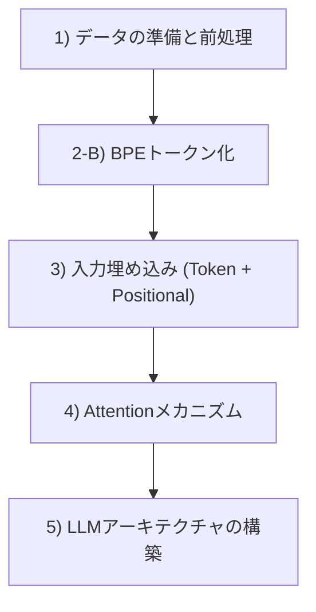

# PyTorchによるLLMスクラッチ自作 (pytorch-llm)

本ディレクトリは、書籍『つくりながら学ぶ！LLM自作入門』の設計思想に基づき、PyTorchを用いて大規模言語モデル（LLM）を一から手書きで実装・学習するためのメインワークスペースです。

---

## 📁 フォルダ構成マップ (Directory Structure)

GitHub上でどこに何があるかを把握するための視覚的ツリー図です。

```text
pytorch-llm/              # 🛠️ LLMスクラッチ自作メインスペース
│
├── basics/               # 💡 PyTorch基本・前提知識デモコード (単機能で学ぶ)
│   ├── pytorch_basics_demo.py      # -> データから訓練・ロードまでの一連の基礎
│   ├── linear_basics_demo.py       # -> Linear層とバイアスの数理実証
│   ├── embedding_demo.py           # -> Embeddingのルックアップの仕組み
│   ├── arange_demo.py              # -> 位置エンコーディング用の連番生成
│   ├── softmax_demo.py             # -> ソフトマックスの数値的安定性と挙動
│   ├── view_basics_demo.py         # -> viewとメモリ上のデータ解釈
│   └── contiguous_basics_demo.py   # -> メモリ連続性とおまじないの正体
│
├── src/                  # 🚀 LLM構築フロー順の本番ソースコード (Step 1〜4)
│   ├── make-vocab.py               # -> [Step 1] テキストからの語彙（辞書）作成
│   ├── Byte-Pair_Encoding.py       # -> [Step 2] BPEトークン化とデータローダー
│   ├── make-embedding.py           # -> [Step 3] トークンと位置の埋め込み合成
│   ├── attention_basics_demo.py    # -> [Step 4] 重みパラメータ付きアテンション
│   └── sample.txt                  # -> トークン化テスト用の入力テキスト
│
└── docs/                 # 📚 ビジュアル解説ドキュメント & 用語集
    ├── llm_development_stages.md    # -> LLMの3ステージとAttentionロードマップ
    ├── llm_terminology.md          # -> 一般概念編 (アテンションの違い、ファインチューニング等)
    ├── pytorch_basics.md           # -> PyTorch基礎編 (Parameter、Module、Linear数理等)
    ├── pytorch_tensor_operations.md# -> テンソル編 (Rank、tril、stack/cat、Storage、contiguous)
    ├── attention_basics.md         # -> Attention数理（加重平均、スケーリング、マスク等）
    ├── dataset_and_dataloader.md   # -> データローダー（max_length, stride等）
    ├── embedding_mechanism.md      # -> 埋め込み（Token + Positional等）
    └── softmax_basics.md           # -> Softmax（次元指定、オーバーフロー対策等）
```

---

## 🗺️ LLM構築の学習ロードマップ

学習と実装は、以下のライフサイクルに従って進めていきます。
開発ステージ全体の解説と詳細なダイアグラムは、[llm_development_stages.md](./docs/llm_development_stages.md) を参照してください。



---

## 📂 各ステップと学習資材の対応表

| 学習フェーズ / ステップ | 実行コード (.py) | 解説ドキュメント (.md) | 学べる内容 |
| :--- | :--- | :--- | :--- |
| **PyTorchの前提知識** | [pytorch_basics_demo.py](./basics/pytorch_basics_demo.py)<br>[linear_basics_demo.py](./basics/linear_basics_demo.py) | [pytorch_basics.md](./docs/pytorch_basics.md) | `nn.Module`モデルの定義、Linear層とバイアスの挙動、パラメータの登録などPyTorch基本ワークフローの振り返り |
| **テンソル・メモリの前提知識** | [view_basics_demo.py](./basics/view_basics_demo.py)<br>[contiguous_basics_demo.py](./basics/contiguous_basics_demo.py) | [pytorch_tensor_operations.md](./docs/pytorch_tensor_operations.md) | `view`のメモリ空間上のデータ解釈（Storage）や、転置後のメモリ非連続性と `contiguous()` おまじないの物理的意味 |
| **Step 1: データの前処理** | [make-vocab.py](./src/make-vocab.py) | [llm_terminology.md](./docs/llm_terminology.md) | テキストから語彙（辞書）を作成する基本的な前処理と、事前学習・ファインチューニングなどのLLM一般用語 |
| **Step 2: トークン化(BPE)** | [Byte-Pair_Encoding.py](./src/Byte-Pair_Encoding.py) | [dataset_and_dataloader.md](./docs/dataset_and_dataloader.md) | サブワード分割（BPE）と、スライディングウィンドウ方式によるデータローダー作成（`max_length`, `stride` の役割） |
| **Step 3: 入力埋め込み** | [make-embedding.py](./src/make-embedding.py) <br>[embedding_demo.py](./basics/embedding_demo.py)<br>[arange_demo.py](./basics/arange_demo.py) | [embedding_mechanism.md](./docs/embedding_mechanism.md) | トークン埋め込み（`nn.Embedding`）と位置埋め込み（`torch.arange`）を足し合わせて入力テンソルを作るプロセス |
| **Step 4: Attentionの基礎** | [attention_basics_demo.py](./src/attention_basics_demo.py)<br>[softmax_demo.py](./basics/softmax_demo.py) | [attention_basics.md](./docs/attention_basics.md)<br>[softmax_basics.md](./docs/softmax_basics.md) | アテンションスコアのドット積と行列積（`inputs @ query`）の対比、Softmaxの性質（オーバーフロー/アンダーフロー、`dim`引数の意味） |

---

## 📄 ライセンスと出典 (Attribution)

本フォルダ内のコードは、学習目的で以下のオープンソースをベースに作成・改変したものです。
*   **オリジナル著者**: Sebastian Raschka 氏
*   **参考リポジトリ**: [LLMs-from-scratch](https://github.com/rasbt/LLMs-from-scratch) (Apache License 2.0)
