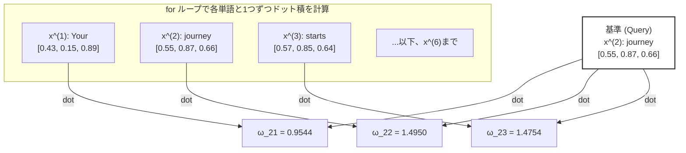

# Attentionスコアの計算と行列演算（ドット積）のメカニズム

Self-Attentionの最初のステップは、入力されたすべての単語（トークン）の間で**「どの単語とどの単語がどれくらい関連しているか」を示す類似度スコア（Attentionスコア）**を計算することです。

本ドキュメントでは、書籍の「図3-8」の処理プロセスをより分かりやすく整理し、ループ処理がどのように効率的な行列演算に変換されるのかを解説します。

---

## 1. ドット積（内積）とは？ なぜ類似度になるのか？

書籍では、2つの単語ベクトルの関連度を計算するために **「ドット積（内積）」** を使用しています。

### 数学的な計算
2つの3次元ベクトル $A = [a_1, a_2, a_3]$ と $B = [b_1, b_2, b_3]$ のドット積は、**「要素ごとに掛け算して、その合計を足したもの」**です。

$$\text{Dot Product} = (a_1 \times b_1) + (a_2 \times b_2) + (a_3 \times b_3)$$

### 直感的な意味：ベクトル同士の「向きの近さ（類似度）」
ドット積には、幾何学的に以下の特徴があります。
*   2つのベクトルが**「同じ方向」**を向いている（似ている）ほど、ドット積の値は**大きく**なります。
*   2つのベクトルが**「直角（無関係）」**に近いほど、値は**ゼロ**に近づきます。
*   2つのベクトルが**「反対方向」**を向いているほど、値は**マイナス**になります。

アテンションメカニズムでは、この性質を利用して、**「ある単語（クエリ）と、他の単語（キー）がどれくらい意味的に近いか」**をドット積で数値化しています。

---

## 2. ループ処理によるスコア計算 (図3-8のプロセス)

2つ目の単語 `"journey"` ($x^{(2)}$) を基準（クエリ）として、文章全体のすべての単語 $x^{(1)}$ 〜 $x^{(6)}$ とのドット積を1つずつループで計算していくアプローチです。



*   **コードでの実装**:
    ```python
    attn_scores = torch.empty(6)
    for i, x_i in enumerate(inputs):
        attn_scores[i] = torch.dot(x_i, query)
    ```

---

## 3. 行列演算による一括計算 (トランスフォーマーの実装)

GPUの並列計算能力を活かすため、実際のトランスフォーマーではループを使わず、**「行列とベクトルの積（行列演算）」** を使って6つのスコアを一度にまとめて計算します。

### 行列演算のビジュアルイメージ

行列 `inputs` (Shape: `[6, 3]`) と、ベクトル `query` (Shape: `[3]`) の積は、以下のように一度に行われます。

```text
    入力行列 (inputs) [6, 3]            クエリ (query) [3]        出力スコア [6]
┌─────────────────────────┐               ┌──────┐               ┌────────┐
│  0.43   0.15   0.89     │  (x^1: Your)  │ 0.55 │               │ 0.9544 │  (ω_21)
│  0.55   0.87   0.66     │  (x^2: journ) │ 0.87 │   ───────>    │ 1.4950 │  (ω_22)
│  0.57   0.85   0.64     │  (x^3: start) │ 0.66 │               │ 1.4754 │  (ω_23)
│  0.22   0.58   0.33     │  (x^4: with)  │  (q) │               │ 0.8434 │  (ω_24)
│  0.77   0.25   0.10     │  (x^5: one)   │      │               │ 0.7070 │  (ω_25)
│  0.05   0.80   0.55     │  (x^6: step)  │      │               │ 1.0865 │  (ω_26)
└─────────────────────────┘               └──────┘               └────────┘
```

*   この掛け算を行うと、各行と列ベクトルの掛け合わせ（ドット積）が全行で並列に計算されます。
*   **コードでの実装**:
    `@` 演算子（行列積）または `torch.matmul` を使います。
    ```python
    attn_scores = inputs @ query  # ループなしで [6] のテンソルが一瞬で求まる
    ```

---

## 4. PyTorch基礎用語の解説

### ① `torch.empty(size)`
*   メモリ上に指定したサイズのテンソルの領域を「確保するだけ」の関数です。
*   `torch.zeros`（ゼロで埋める）や `torch.ones`（1で埋める）と違い、**メモリの初期化（値を書き込む処理）を行わないため、非常に高速**に動作します。
*   初期化しないため、中身にはメモリ上に残っていたランダムな数値（ゴミデータ）が入っています。後からループの中などで値を上書きして代入することが決まっている場合に、パフォーマンス向上のために使われます。

### ② `enumerate(iterable)`
*   Pythonの組み込み関数で、ループ処理の際に「現在の回数（インデックス）」と「要素」を同時に取得できます。
*   アテンションスコアを保存する配列のインデックス（`i` 番目）を指定しつつ、各トークンのベクトル（`x_i`）を取り出すのに非常に便利です。

---

## 5. torch.dot と @ (torch.matmul) の違い

アテンションの実装では、ベクトルや行列の掛け算が多用されますが、使用する関数や演算子によって「入力できる次元数（Shape）」のルールが異なります。

| 演算方法 | `@` 演算子 / `torch.matmul` | `torch.dot` |
| :--- | :--- | :--- |
| **役割** | **万能な行列積・ドット積** | **1次元ベクトル同士のドット積のみ** |
| **1次元 vs 1次元** | 動作する (ドット積) | 動作する (ドット積) |
| **2次元 vs 1次元** | 動作する (行列・ベクトルの積) | **エラーになる** (1次元しか受け付けないため) |
| **2次元 vs 2次元** | 動作する (通常の行列積) | **エラーになる** |

### ① `@` 演算子 と `torch.matmul` は何が違う？
*   **機能は完全に同じ**です。`a @ b` と記述すると、Python内部で `torch.matmul(a, b)` が自動的に呼び出されます。
*   `@` は可読性を高めるためのショートカット（糖衣構文）です。

### ② なぜ今回の行列一括計算で `torch.dot` は使えないのか？
*   今回の `inputs` は `[6, 3]` という**2次元行列**です。
*   `torch.dot(inputs, query)` と書くと、`inputs` が1次元ではないため `RuntimeError` エラーになります。
*   そのため、2次元行列と1次元ベクトルの積を計算できる `@`（または `torch.matmul`）を使用する必要があります。

---

## 6. 二重ループと行列演算（inputs @ inputs.T）の劇的な速度差の理由

Pythonの二重 `for` ループで1つずつ内積を計算する方法と、行列積 `@` を使って一括で計算する方法とでは、データの規模が大きくなるにつれて**数百倍〜数万倍の速度差**が生じます。

この圧倒的な差を生み出す理由は主に3つあります。

### ① Pythonのループ処理に伴うオーバーヘッド（遅さ）
*   **ループ**: Pythonは一行ずつコードを解釈して動的に実行する言語（インタープリタ）です。`for` ループが回るたびに、内部では「インデックスのチェック」「変数のメモリ確保」「型チェック」などの余分な管理用処理（オーバーヘッド）が走り、これがボトルネックになります。
*   **行列積**: 行列積の `@` 演算子を実行すると、Pythonのループを一切通らず、裏側の**C++やCUDA（GPU向け）でコンパイルされた超高速な計算エンジン**に処理が一任されます。

### ② ハードウェアによる並列化 (SIMD・GPUアクセラレーション)
*   **ループ**: 基本的にCPUの1つのコアが、6×6＝36回（大規模なら何百万回）の内積を「1つずつ順番に」計算していきます（シーケンシャル処理）。
*   **行列積**: 計算エンジンは、CPUのマルチコアやGPUの数千個のコアをフルに活用し、**「すべての内積の組み合わせを同時に（並列で）」計算**します。これを「ベクタライズ（ベクトル化）」や「SIMD（Single Instruction Multiple Data）」と呼びます。

### ③ メモリアクセスとキャッシュの最適化（GEMMカーネル）
*   計算のボトルネックは、演算速度だけでなく「メモリ（RAM）からデータを読み込む遅さ」にもあります。
*   二重ループで `inputs[i]` と `inputs[j]` をバラバラに読み込むと、メモリへのアクセス回数が増え、CPUの超高速な「キャッシュメモリ」を有効活用できません。
*   行列積は、コンピュータ科学の歴史の中で最も最適化が進んでいる **GEMM (General Matrix Multiply)** というアルゴリズムに基づいており、データがキャッシュ上にきれいに収まるようにメモリのロード順まで極限までチューニングされています。

> 💡 **LLM開発における教訓**
> ディープラーニングにおいて、**「`for` ループは極力使わず、行列演算（テンソル演算）に置き換える」** のが鉄則とされるのはこのためです。

---

## 7. コンテキストベクトルの行列演算（attn_weights @ inputs）の仕組み

アテンションの最終ステップでは、正規化されたアテンションの重み（`attn_weights`）を使って、元の単語ベクトル（`inputs`）の加重平均を計算し、**コンテキストベクトルを一括で作成**します。

この時の行列積 `attn_weights @ inputs` の形状の対応関係とデータの流れを整理します。

### ① 行列積が成立するルール（次元のチェック）
行列の掛け算（行列積）は、**「左側の列数」と「右側の行数」が一致**している必要があります。

*   `attn_weights` の形状: **`[6, 6]`** （6行 6列）
*   `inputs` の形状: **`[6, 3]`** （6行 3列）
*   **次元のチェック**: 左の列数 `6` と、右の行数 `6` が一致しているため、計算は正常に行われます。
*   結果の形状: **`[6, 3]`** （6つの単語に対する、3次元のコンテキストベクトル $z$ の行列）

```text
       attn_weights          inputs             結果 (all_context_vecs)
        [6 x 6]             [6 x 3]                   [6 x 3]
     ┌───────────┐       ┌───────────┐             ┌───────────┐
     │           │       │           │             │           │
   6 │           │     6 │           │    ───>   6 │           │
     │           │       │           │             │           │
     └───────────┘       └───────────┘             └───────────┘
           6                   3                         3
           ▲                   ▲
           └─────一致する──────┘
```

### ② 内部で行われている「加重平均」のビジュアル

結果の行列 `all_context_vecs` の1行目（1つ目のトークン "Your" に対するコンテキストベクトル $z^{(1)}$）が計算されるプロセスを切り出してみます。

1.  **アテンション重みの1行目**:
    `Your` が全6単語に向ける重みのリスト: `[α11, α12, α13, α14, α15, α16]` (形状: `[6]`)
2.  **元の単語ベクトル (inputs)**:
    各単語の3次元ベクトル: `[x1, x2, x3, x4, x5, x6]` (形状: `[6, 3]`)
3.  **行列積の計算**:
    左の1行目のベクトルと、右の行列全体を掛け合わせます。

```text
  重みの1行目 [6]                  元の単語ベクトル (inputs) [6, 3]
┌─────────────────────────┐      ┌─────────────────────────┐
│ α11  α12  α13  ...  α16 │   x  │  x1_1   x1_2   x1_3     │  (x1: Your)
└─────────────────────────┘      │  x2_1   x2_2   x2_3     │  (x2: journey)
                                 │  x3_1   x3_2   x3_3     │  (x3: starts)
                                 │   ...    ...    ...     │
                                 └─────────────────────────┘
                                              │
                                              ▼ 加重平均の計算
    z^(1) = α11 * x1  +  α12 * x2  +  α13 * x3  +  ...  +  α16 * x6  (形状: [3])
```

この計算によって、**「元の Your の意味 $x_1$ に、周囲の単語の意味 $x_2$ 〜 $x_6$ が重み付きでミックスされた、強化された3次元のベクトル $z^{(1)}$」** が完成します。

この行ごとの計算が全6行に対して同時に並列処理されるため、`[6, 6] @ [6, 3]` という行列演算になり、最終的な出力は `[6, 3]`（6単語分のコンテキストベクトル）になります。

> 💡 **コラム：数学の計算ルール（行 × 列）と、データ的な意味（行ベクトルのブレンド）のギャップ**
> 行列の積は、数学の定義上**「左の『行』」と「右の『列（タテのライン）』」**の掛け算（ドット積）です。
> そのため、「`inputs` の列（タテ）を掛けているのに、どうして単語ベクトル（行）全体をブレンドしていることになるの？」と一見不思議に思えます。
> 
> これが完全に一致することを、極小サイズ（**3つの単語、2次元ベクトル**）で数式をバラして確認してみましょう。
> 
> *   アテンション重み: $W = [w_1, w_2, w_3]$
> *   3つの単語ベクトル（inputs）:
>     *   単語1 ($x_1$) = $[a_1, a_2]$
>     *   単語2 ($x_2$) = $[b_1, b_2]$
>     *   単語3 ($x_3$) = $[c_1, c_2]$
>     *   行列 `inputs` の形:
>         ```text
>         [ a1,  a2 ]  (単語1: x1)
>         [ b1,  b2 ]  (単語2: x2)
>         [ c1,  c2 ]  (単語3: x3)
>           ▲    ▲
>          1列目 2列目 (縦のライン)
>         ```
> 
> #### 1. 【やりたい計算】単語ベクトル（行）全体のブレンド（加重平均）
> 各単語のベクトルに重みを掛けて、足し算します。
> 
> $$w_1 \cdot x_1 + w_2 \cdot x_2 + w_3 \cdot x_3$$
> $$= w_1 [a_1, a_2] + w_2 [b_1, b_2] + w_3 [c_1, c_2]$$
> $$= [w_1 a_1, w_1 a_2] + [w_2 b_1, w_2 b_2] + [w_3 c_1, w_3 c_2]$$
> 
> これらを要素ごとに足し合わせると、結果は次の **1つのベクトル** になります。
> 
> $$\text{Result} = [w_1 a_1 + w_2 b_1 + w_3 c_1, \ \ w_1 a_2 + w_2 b_2 + w_3 c_2]$$
> 
> #### 2. 【行列積の計算】左の行ベクトル $W$ と 右の行列 `inputs` の掛け算
> 行列積のルールに従って、「左の行」と「右のタテ列」を順番に掛け算して並べます。
> 
> *   結果の1つ目の要素（左の行 × 縦1列目）:
>     $$w_1 a_1 + w_2 b_1 + w_3 c_1$$
> *   結果の2つ目の要素（左の行 × 縦2列目）:
>     $$w_1 a_2 + w_2 b_2 + w_3 c_2$$
> 
> これを並べて1つのベクトルにすると：
> 
> $$\text{Result} = [w_1 a_1 + w_2 b_1 + w_3 c_1, \ \ w_1 a_2 + w_2 b_2 + w_3 c_2]$$
> 
> #### 📊 結論
> **「単語ベクトルの足し算（1）」と「行列積のタテの計算（2）」は、まったく同じ結果になります。**
> 
> 行列積の「タテの列を掛ける」というルールは、データの視点で見ると「ベクトルの要素ごとに、重み付きのブレンド計算を並列で実行している」ことに他なりません。結果として、行ベクトル全体が美しくブレンドされます。
