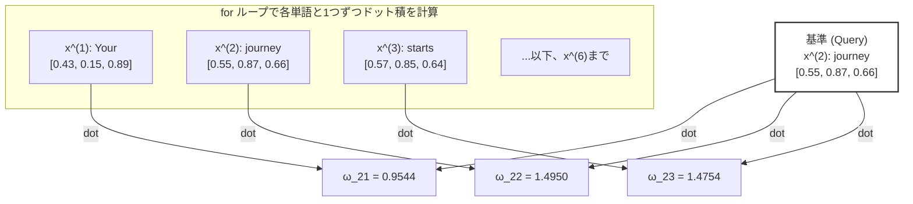

# Attentionスコアの計算と行列演算（ドット積）のメカニズム

Self-Attentionの最初のステップは、入力されたすべての単語（トークン）の間で**「どの単語とどの単語がどれくらい関連しているか」を示す類似度スコア（Attentionスコア）**を計算することです。

本ドキュメントでは、書籍の「図3-8」の処理プロセスをより分かりやすく整理し、ループ処理がどのように効率的な行列演算に変換されるのかを解説します。

---

## 1. ドット積（内積）とは？ なぜ類似度になるのか？

書籍では、2つの単語ベクトルの関連度を計算するために **「ドット積（内積）」** を使用しています。

### 数学的な計算
2つの3次元ベクトル $A = [a_1, a_2, a_3]$ と $B = [b_1, b_2, b_3]$ のドット積は、**「要素ごとに掛け算して、その合計を足したもの」**です。

$$\text{Dot Product} = (a_1 \times b_1) + (a_2 \times b_2) + (a_3 \times b_3)$$

### 直感的な意味：ベクトル同士の「向きの近さ（類似度）」
ドット積には、幾何学的に以下の特徴があります。
*   2つのベクトルが**「同じ方向」**を向いている（似ている）ほど、ドット積の値は**大きく**なります。
*   2つのベクトルが**「直角（無関係）」**に近いほど、値は**ゼロ**に近づきます。
*   2つのベクトルが**「反対方向」**を向いているほど、値は**マイナス**になります。

アテンションメカニズムでは、この性質を利用して、**「ある単語（クエリ）と、他の単語（キー）がどれくらい意味的に近いか」**をドット積で数値化しています。

---

## 2. ループ処理によるスコア計算 (図3-8のプロセス)

2つ目の単語 `"journey"` ($x^{(2)}$) を基準（クエリ）として、文章全体のすべての単語 $x^{(1)}$ 〜 $x^{(6)}$ とのドット積を1つずつループで計算していくアプローチです。



*   **コードでの実装**:
    ```python
    attn_scores = torch.empty(6)
    for i, x_i in enumerate(inputs):
        attn_scores[i] = torch.dot(x_i, query)
    ```

---

## 3. 行列演算による一括計算 (トランスフォーマーの実装)

GPUの並列計算能力を活かすため、実際のトランスフォーマーではループを使わず、**「行列とベクトルの積（行列演算）」** を使って6つのスコアを一度にまとめて計算します。

### 行列演算のビジュアルイメージ

行列 `inputs` (Shape: `[6, 3]`) と、ベクトル `query` (Shape: `[3]`) の積は、以下のように一度に行われます。

```text
    入力行列 (inputs) [6, 3]            クエリ (query) [3]        出力スコア [6]
┌─────────────────────────┐               ┌──────┐               ┌────────┐
│  0.43   0.15   0.89     │  (x^1: Your)  │ 0.55 │               │ 0.9544 │  (ω_21)
│  0.55   0.87   0.66     │  (x^2: journ) │ 0.87 │   ───────>    │ 1.4950 │  (ω_22)
│  0.57   0.85   0.64     │  (x^3: start) │ 0.66 │               │ 1.4754 │  (ω_23)
│  0.22   0.58   0.33     │  (x^4: with)  │  (q) │               │ 0.8434 │  (ω_24)
│  0.77   0.25   0.10     │  (x^5: one)   │      │               │ 0.7070 │  (ω_25)
│  0.05   0.80   0.55     │  (x^6: step)  │      │               │ 1.0865 │  (ω_26)
└─────────────────────────┘               └──────┘               └────────┘
```

*   この掛け算を行うと、各行と列ベクトルの掛け合わせ（ドット積）が全行で並列に計算されます。
*   **コードでの実装**:
    `@` 演算子（行列積）または `torch.matmul` を使います。
    ```python
    attn_scores = inputs @ query  # ループなしで [6] のテンソルが一瞬で求まる
    ```

---

## 4. PyTorch基礎用語の解説

### ① `torch.empty(size)`
*   メモリ上に指定したサイズのテンソルの領域を「確保するだけ」の関数です。
*   `torch.zeros`（ゼロで埋める）や `torch.ones`（1で埋める）と違い、**メモリの初期化（値を書き込む処理）を行わないため、非常に高速**に動作します。
*   初期化しないため、中身にはメモリ上に残っていたランダムな数値（ゴミデータ）が入っています。後からループの中などで値を上書きして代入することが決まっている場合に、パフォーマンス向上のために使われます。

### ② `enumerate(iterable)`
*   Pythonの組み込み関数で、ループ処理の際に「現在の回数（インデックス）」と「要素」を同時に取得できます。
*   アテンションスコアを保存する配列のインデックス（`i` 番目）を指定しつつ、各トークンのベクトル（`x_i`）を取り出すのに非常に便利です。

---

## 5. torch.dot と @ (torch.matmul) の違い

アテンションの実装では、ベクトルや行列の掛け算が多用されますが、使用する関数や演算子によって「入力できる次元数（Shape）」のルールが異なります。

| 演算方法 | `@` 演算子 / `torch.matmul` | `torch.dot` |
| :--- | :--- | :--- |
| **役割** | **万能な行列積・ドット積** | **1次元ベクトル同士のドット積のみ** |
| **1次元 vs 1次元** | 動作する (ドット積) | 動作する (ドット積) |
| **2次元 vs 1次元** | 動作する (行列・ベクトルの積) | **エラーになる** (1次元しか受け付けないため) |
| **2次元 vs 2次元** | 動作する (通常の行列積) | **エラーになる** |

### ① `@` 演算子 と `torch.matmul` は何が違う？
*   **機能は完全に同じ**です。`a @ b` と記述すると、Python内部で `torch.matmul(a, b)` が自動的に呼び出されます。
*   `@` は可読性を高めるためのショートカット（糖衣構文）です。

### ② なぜ今回の行列一括計算で `torch.dot` は使えないのか？
*   今回の `inputs` は `[6, 3]` という**2次元行列**です。
*   `torch.dot(inputs, query)` と書くと、`inputs` が1次元ではないため `RuntimeError` エラーになります。
*   そのため、2次元行列と1次元ベクトルの積を計算できる `@`（または `torch.matmul`）を使用する必要があります。
