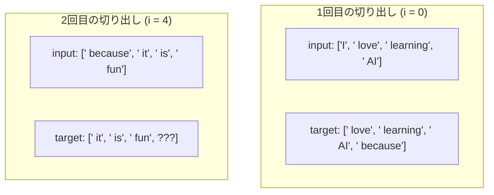
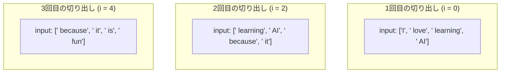

# LLMデータセット作成：スライディングウィンドウ (`max_length` と `stride`)

LLMにテキストを学習させる際、長い本や文章を丸ごと一度に入力することはできません。そのため、文章を一定の「長さ」に切り分けてミニバッチを作成します。
その際にデータを切り分けるルールを決める重要なパラメータが、**`max_length` (最大長)** と **`stride` (歩幅/ずらし幅)** です。

---

## 1. パラメータの定義

### ① `max_length` （最大長 / コンテキストサイズ）
*   **意味**: モデルが一度に処理する（見ることができる）**トークンの最大数**です。
*   **役割**: モデルに一度に入力するデータの長さを決定します。
*   **例**: `max_length = 4` の場合、入力データは常に 4 トークン分ずつ切り出されます。

### ② `stride` （ストライド / 歩幅 / 移動幅）
*   **意味**: 次のデータを切り出す際に、**ウィンドウを右にいくつずらすか**という移動幅です。
*   **役割**: データセットを作る際、どれくらいデータを重複させる（オーバーラップさせる）かを決定します。
*   **例**: `stride = 2` であれば、2トークンずつ右にずらしながら次のデータを切り出します。

---

## 2. 具体例で見るスライディングウィンドウ

以下の 8トークンのテキストを例にします。
`["I", " love", " learning", " AI", " because", " it", " is", " fun"]`

### 💡 パターンA：`max_length = 4`, `stride = 4` の場合（重複なし）
ずらす幅（`stride`）がデータの長さ（`max_length`）と同じであるため、データは重ならずに「ぶつ切り」になります。


※ `target` は常に `input` より 1 トークン先の「未来」を予測するため、右に 1 つずれたデータになります（2回目は次のトークンが存在しないため、データセット作成ループの境界条件によって切り出されません）。

---

### 💡 パターンB：`max_length = 4`, `stride = 2` の場合（一部重複）
ずらす幅がデータの長さより小さいため、一部のデータが重なりながら切り出されます。これにより、同じ文章からより多くの学習パターンを作成できます。


*   1回目と2回目で `learning` と `AI` が重複しています。
*   2回目と3回目で `because` と `it` が重複しています。

---

## 3. 実装コードとの対応

PyTorch の `GPTDatasetV1` クラスの初期化 (`__init__`) では、このスライディングウィンドウのロジックが以下のようにループ文で記述されています。

```python
# len(token_ids) - max_length の範囲内で、stride ずつインデックス i を進める
for i in range(0, len(token_ids) - max_length, stride):
    # i から max_length 分をインプットとする
    input_chunk = token_ids[i:i + max_length]
    
    # input より 1 インデックスずらしたものをターゲットとする（次の単語の予測）
    target_chunk = token_ids[i + 1: i + max_length + 1]
    
    self.input_ids.append(torch.tensor(input_chunk))
    self.target_ids.append(torch.tensor(target_chunk))
```

*   **データセットの作成例**:
    ```python
    # コンテキストサイズ4、ストライド4（重複なし）でローダーを作成
    dataloader = create_dataloader_v1(
        raw_text, batch_size=8, max_length=4, stride=4, shuffle=False
    )
    ```

---

## 4. なぜ調整するのか？

*   **`stride` を小さく（例: `1` や `max_length // 2`）するメリット**:
    限られたテキストデータから、非常に多くの学習バッチを生成できます。また、単語のつながりを細かく網羅できます。
*   **`stride = max_length` にするメリット**:
    データの重複がないため、エポックごとの学習効率が良く、重複データによる過学習のリスクを抑えられます。テスト（評価）データを作成するときなどによく使われます。
