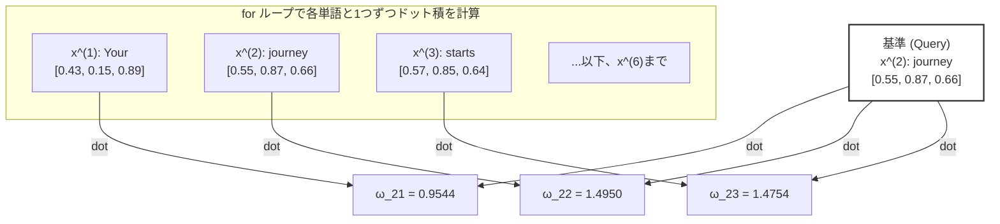
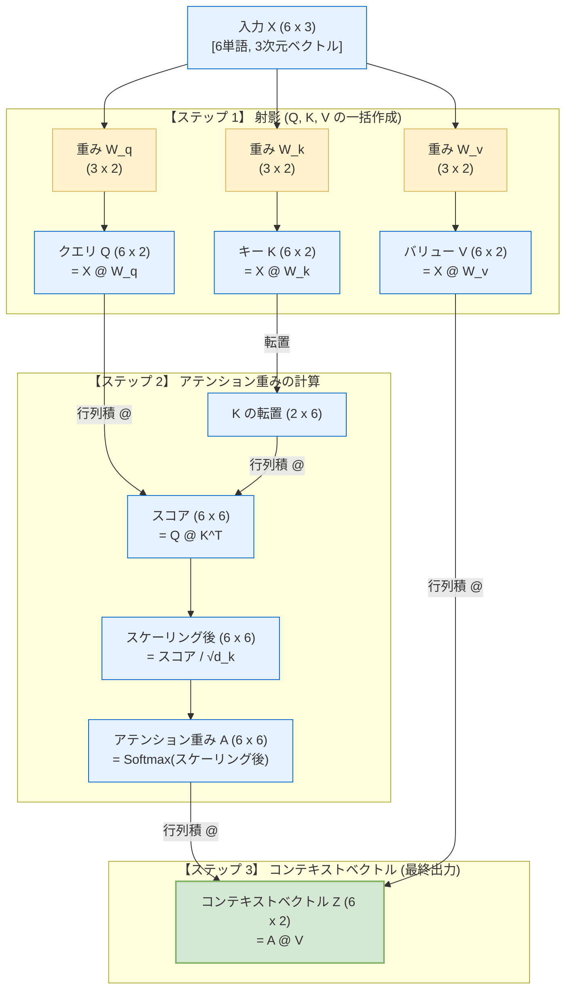
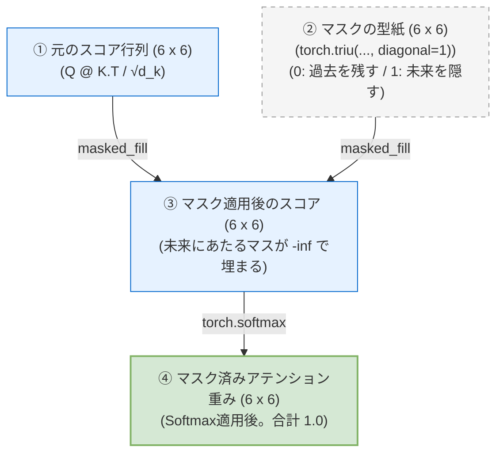

# Attentionスコアの計算と行列演算（ドット積）のメカニズム

Self-Attentionの最初のステップは、入力されたすべての単語（トークン）の間で**「どの単語とどの単語がどれくらい関連しているか」を示す類似度スコア（Attentionスコア）**を計算することです。

本ドキュメントでは、書籍の「図3-8」の処理プロセスをより分かりやすく整理し、ループ処理がどのように効率的な行列演算に変換されるのかを解説します。

---

## 1. ドット積（内積）とは？ なぜ類似度になるのか？

書籍では、2つの単語ベクトルの関連度を計算するために **「ドット積（内積）」** を使用しています。

### 数学的な計算
2つの3次元ベクトル $A = [a_1, a_2, a_3]$ と $B = [b_1, b_2, b_3]$ のドット積は、**「要素ごとに掛け算して、その合計を足したもの」**です。

$$\text{Dot Product} = (a_1 \times b_1) + (a_2 \times b_2) + (a_3 \times b_3)$$

### 直感的な意味：ベクトル同士の「向きの近さ（類似度）」
ドット積には、幾何学的に以下の特徴があります。
*   2つのベクトルが**「同じ方向」**を向いている（似ている）ほど、ドット積の値は**大きく**なります。
*   2つのベクトルが**「直角（無関係）」**に近いほど、値は**ゼロ**に近づきます。
*   2つのベクトルが**「反対方向」**を向いているほど、値は**マイナス**になります。

アテンションメカニズムでは、この性質を利用して、**「ある単語（クエリ）と、他の単語（キー）がどれくらい意味的に近いか」**をドット積で数値化しています。

---

## 2. ループ処理によるスコア計算 (図3-8のプロセス)

2つ目の単語 `"journey"` ($x^{(2)}$) を基準（クエリ）として、文章全体のすべての単語 $x^{(1)}$ 〜 $x^{(6)}$ とのドット積を1つずつループで計算していくアプローチです。



*   **コードでの実装**:
    ```python
    attn_scores = torch.empty(6)
    for i, x_i in enumerate(inputs):
        attn_scores[i] = torch.dot(x_i, query)
    ```

---

## 3. 行列演算による一括計算 (トランスフォーマーの実装)

GPUの並列計算能力を活かすため、実際のトランスフォーマーではループを使わず、**「行列とベクトルの積（行列演算）」** を使って6つのスコアを一度にまとめて計算します。

### 行列演算のビジュアルイメージ

行列 `inputs` (Shape: `[6, 3]`) と、ベクトル `query` (Shape: `[3]`) の積は、以下のように一度に行われます。

```text
    入力行列 (inputs) [6, 3]            クエリ (query) [3]        出力スコア [6]
┌─────────────────────────┐               ┌──────┐               ┌────────┐
│  0.43   0.15   0.89     │  (x^1: Your)  │ 0.55 │               │ 0.9544 │  (ω_21)
│  0.55   0.87   0.66     │  (x^2: journ) │ 0.87 │   ───────>    │ 1.4950 │  (ω_22)
│  0.57   0.85   0.64     │  (x^3: start) │ 0.66 │               │ 1.4754 │  (ω_23)
│  0.22   0.58   0.33     │  (x^4: with)  │  (q) │               │ 0.8434 │  (ω_24)
│  0.77   0.25   0.10     │  (x^5: one)   │      │               │ 0.7070 │  (ω_25)
│  0.05   0.80   0.55     │  (x^6: step)  │      │               │ 1.0865 │  (ω_26)
└─────────────────────────┘               └──────┘               └────────┘
```

*   この掛け算を行うと、各行と列ベクトルの掛け合わせ（ドット積）が全行で並列に計算されます。
*   **コードでの実装**:
    `@` 演算子（行列積）または `torch.matmul` を使います。
    ```python
    attn_scores = inputs @ query  # ループなしで [6] のテンソルが一瞬で求まる
    ```

---

## 4. PyTorch基礎用語の解説

### ① `torch.empty(size)`
*   メモリ上に指定したサイズのテンソルの領域を「確保するだけ」の関数です。
*   `torch.zeros`（ゼロで埋める）や `torch.ones`（1で埋める）と違い、**メモリの初期化（値を書き込む処理）を行わないため、非常に高速**に動作します。
*   初期化しないため、中身にはメモリ上に残っていたランダムな数値（ゴミデータ）が入っています。後からループの中などで値を上書きして代入することが決まっている場合に、パフォーマンス向上のために使われます。

### ② `enumerate(iterable)`
*   Pythonの組み込み関数で、ループ処理の際に「現在の回数（インデックス）」と「要素」を同時に取得できます。
*   アテンションスコアを保存する配列のインデックス（`i` 番目）を指定しつつ、各トークンのベクトル（`x_i`）を取り出すのに非常に便利です。

---

## 5. torch.dot と @ (torch.matmul) の違い

アテンションの実装では、ベクトルや行列の掛け算が多用されますが、使用する関数や演算子によって「入力できる次元数（Shape）」のルールが異なります。

| 演算方法 | `@` 演算子 / `torch.matmul` | `torch.dot` |
| :--- | :--- | :--- |
| **役割** | **万能な行列積・ドット積** | **1次元ベクトル同士のドット積のみ** |
| **1次元 vs 1次元** | 動作する (ドット積) | 動作する (ドット積) |
| **2次元 vs 1次元** | 動作する (行列・ベクトルの積) | **エラーになる** (1次元しか受け付けないため) |
| **2次元 vs 2次元** | 動作する (通常の行列積) | **エラーになる** |

### ① `@` 演算子 と `torch.matmul` は何が違う？
*   **機能は完全に同じ**です。`a @ b` と記述すると、Python内部で `torch.matmul(a, b)` が自動的に呼び出されます。
*   `@` は可読性を高めるためのショートカット（糖衣構文）です。

### ② なぜ今回の行列一括計算で `torch.dot` は使えないのか？
*   今回の `inputs` は `[6, 3]` という**2次元行列**です。
*   `torch.dot(inputs, query)` と書くと、`inputs` が1次元ではないため `RuntimeError` エラーになります。
*   そのため、2次元行列と1次元ベクトルの積を計算できる `@`（または `torch.matmul`）を使用する必要があります。

---

## 6. 二重ループと行列演算（inputs @ inputs.T）の劇的な速度差の理由

Pythonの二重 `for` ループで1つずつ内積を計算する方法と、行列積 `@` を使って一括で計算する方法とでは、データの規模が大きくなるにつれて**数百倍〜数万倍の速度差**が生じます。

この圧倒的な差を生み出す理由は主に3つあります。

### ① Pythonのループ処理に伴うオーバーヘッド（遅さ）
*   **ループ**: Pythonは一行ずつコードを解釈して動的に実行する言語（インタープリタ）です。`for` ループが回るたびに、内部では「インデックスのチェック」「変数のメモリ確保」「型チェック」などの余分な管理用処理（オーバーヘッド）が走り、これがボトルネックになります。
*   **行列積**: 行列積の `@` 演算子を実行すると、Pythonのループを一切通らず、裏側の**C++やCUDA（GPU向け）でコンパイルされた超高速な計算エンジン**に処理が一任されます。

### ② ハードウェアによる並列化 (SIMD・GPUアクセラレーション)
*   **ループ**: 基本的にCPUの1つのコアが、6×6＝36回（大規模なら何百万回）の内積を「1つずつ順番に」計算していきます（シーケンシャル処理）。
*   **行列積**: 計算エンジンは、CPUのマルチコアやGPUの数千個のコアをフルに活用し、**「すべての内積の組み合わせを同時に（並列で）」計算**します。これを「ベクタライズ（ベクトル化）」や「SIMD（Single Instruction Multiple Data）」と呼びます。

### ③ メモリアクセスとキャッシュの最適化（GEMMカーネル）
*   計算のボトルネックは、演算速度だけでなく「メモリ（RAM）からデータを読み込む遅さ」にもあります。
*   二重ループで `inputs[i]` と `inputs[j]` をバラバラに読み込むと、メモリへのアクセス回数が増え、CPUの超高速な「キャッシュメモリ」を有効活用できません。
*   行列積は、コンピュータ科学の歴史の中で最も最適化が進んでいる **GEMM (General Matrix Multiply)** というアルゴリズムに基づいており、データがキャッシュ上にきれいに収まるようにメモリのロード順まで極限までチューニングされています。

> 💡 **LLM開発における教訓**
> ディープラーニングにおいて、**「`for` ループは極力使わず、行列演算（テンソル演算）に置き換える」** のが鉄則とされるのはこのためです。

---

## 7. コンテキストベクトルの行列演算（attn_weights @ inputs）の仕組み

アテンションの最終ステップでは、正規化されたアテンションの重み（`attn_weights`）を使って、元の単語ベクトル（`inputs`）の加重平均を計算し、**コンテキストベクトルを一括で作成**します。

この時の行列積 `attn_weights @ inputs` の形状の対応関係とデータの流れを整理します。

### ① 行列積が成立するルール（次元のチェック）
行列の掛け算（行列積）は、**「左側の列数」と「右側の行数」が一致**している必要があります。

*   `attn_weights` の形状: **`[6, 6]`** （6行 6列）
*   `inputs` の形状: **`[6, 3]`** （6行 3列）
*   **次元のチェック**: 左の列数 `6` と、右の行数 `6` が一致しているため、計算は正常に行われます。
*   結果の形状: **`[6, 3]`** （6つの単語に対する、3次元のコンテキストベクトル $z$ の行列）

```text
       attn_weights          inputs             結果 (all_context_vecs)
        [6 x 6]             [6 x 3]                   [6 x 3]
     ┌───────────┐       ┌───────────┐             ┌───────────┐
     │           │       │           │             │           │
   6 │           │     6 │           │    ───>   6 │           │
     │           │       │           │             │           │
     └───────────┘       └───────────┘             └───────────┘
           6                   3                         3
           ▲                   ▲
           └─────一致する──────┘
```

### ② 内部で行われている「加重平均」のビジュアル

結果の行列 `all_context_vecs` の2行目（2つ目のトークン "journey" に対するコンテキストベクトル $z^{(2)}$）が計算されるプロセスを切り出してみます。

1.  **アテンション重みの2行目**:
    `journey` が全6単語に向ける重みのリスト: `[0.1385, 0.2379, 0.2333, 0.1240, 0.1082, 0.1581]` (合計 1.0)
2.  **元の単語ベクトル (inputs)**:
    各単語の3次元ベクトル（$x^{(1)}$ 〜 $x^{(6)}$）

この重みを行単位で掛け合わせ、すべての単語ベクトルをブレンド（加重平均）します。

```text
  アテンション重みの2行目                     元の単語ベクトル (inputsの各行)
   (journey の重みリスト)
┌─────────────────────────┐               ┌─────────────────────────────────┐
│.1385 .2379 .2333 ...    │      x        │ x^(1) [0.43, 0.15, 0.89] (Your) │
└─────────────────────────┘               │ x^(2) [0.55, 0.87, 0.66] (journ)│
                                          │ x^(3) [0.57, 0.85, 0.64] (start)│
                                          │  ...  (以下、x^(6)まで)         │
                                          └─────────────────────────────────┘
                                                           │
                                                           ▼ 【行単位の加重平均】
 z^(2) = 0.1385 * x^(1) + 0.2379 * x^(2) + 0.2333 * x^(3) + ... + 0.1581 * x^(6)

       = 0.1385 * [0.43, 0.15, 0.89]
       + 0.2379 * [0.55, 0.87, 0.66]
       + 0.2333 * [0.57, 0.85, 0.64]
       + 0.1240 * [0.22, 0.58, 0.33]
       + 0.1082 * [0.77, 0.25, 0.10]
       + 0.1581 * [0.05, 0.80, 0.55]
       ─────────────────────────────────
       = [0.4419, 0.6515, 0.5683]  <── 完成した3次元のコンテキストベクトル (z^2)
```

この計算によって、**「元の journey の意味 $x^{(2)}$ に、周囲の単語の意味 $x^{(1)}$ 〜 $x^{(6)}$ が重み付きでミックスされた、強化された3次元のベクトル $z^{(2)}$」** が完成します。

この行ごとの計算が全6行に対して同時に並列処理されるため、`[6, 6] @ [6, 3]` という行列演算になり、最終的な出力は `[6, 3]`（6単語分のコンテキストベクトル）になります。

> 💡 **コラム：数学の計算ルール（行 × 列）と、データ的な意味（行ベクトルのブレンド）のギャップ**
> 行列の積は、数学の定義上**「左の『行』」と「右の『列（タテのライン）』」**の掛け算（ドット積）です。
> そのため、「`inputs` の列（タテ）を掛けているのに、どうして単語ベクトル（行）全体をブレンドしていることになるの？」と一見不思議に思えます。
> 
> これが完全に一致することを、極小サイズ（**3つの単語、2次元ベクトル**）で数式をバラして確認してみましょう。
> 
> *   アテンション重み: $W = [w_1, w_2, w_3]$
> *   3つの単語ベクトル（inputs）:
>     *   単語1 ($x_1$) = $[a_1, a_2]$
>     *   単語2 ($x_2$) = $[b_1, b_2]$
>     *   単語3 ($x_3$) = $[c_1, c_2]$
>     *   行列 `inputs` の形:
>         ```text
>         [ a1,  a2 ]  (単語1: x1)
>         [ b1,  b2 ]  (単語2: x2)
>         [ c1,  c2 ]  (単語3: x3)
>           ▲    ▲
>          1列目 2列目 (縦のライン)
>         ```
> 
> #### 1. 【やりたい計算】単語ベクトル（行）全体のブレンド（加重平均）
> 各単語のベクトルに重みを掛けて、足し算します。
> 
> $$w_1 \cdot x_1 + w_2 \cdot x_2 + w_3 \cdot x_3$$
> $$= w_1 [a_1, a_2] + w_2 [b_1, b_2] + w_3 [c_1, c_2]$$
> $$= [w_1 a_1, w_1 a_2] + [w_2 b_1, w_2 b_2] + [w_3 c_1, w_3 c_2]$$
> 
> これらを要素ごとに足し合わせると、結果は次の **1つのベクトル** になります。
> 
> $$\text{Result} = [w_1 a_1 + w_2 b_1 + w_3 c_1, \ \ w_1 a_2 + w_2 b_2 + w_3 c_2]$$
> 
> #### 2. 【行列積の計算】左の行ベクトル $W$ と 右の行列 `inputs` の掛け算
> 行列積のルールに従って、「左の行」と「右のタテ列」を順番に掛け算して並べます。
> 
> *   結果の1つ目の要素（左の行 × 縦1列目）:
>     $$w_1 a_1 + w_2 b_1 + w_3 c_1$$
> *   結果の2つ目の要素（左の行 × 縦2列目）:
>     $$w_1 a_2 + w_2 b_2 + w_3 c_2$$
> 
> これを並べて1つのベクトルにすると：
> 
> $$\text{Result} = [w_1 a_1 + w_2 b_1 + w_3 c_1, \ \ w_1 a_2 + w_2 b_2 + w_3 c_2]$$
> 
> #### 📊 結論
> **「単語ベクトルの足し算（1）」と「行列積のタテの計算（2）」は、まったく同じ結果になります。**
> 
> 行列積の「タテの列を掛ける」というルールは、データの視点で見ると「ベクトルの要素ごとに、重み付きのブレンド計算を並列で実行している」ことに他なりません。結果として、行ベクトル全体が美しくブレンドされます。

---

## 8. 訓練可能なSelf-Attention：3つの重みパラメータ（W_query, W_key, W_value）

「アテンションの進化ロードマップ」のステップ2である **訓練可能なSelf-Attention（Scaled Dot-Product Attention）** では、入力ベクトル $x$ を直接計算に使うのではなく、あらかじめ定義した3つの**重みパラメータ（行列）**を掛けて、別の役割を持つベクトルに変換してから計算を行います。

```text
       ┌───> W_query ───> query   (検索の質問)
       │
  x   ─┼───> W_key   ───> key     (検索のインデックス/見出し)
       │
       └───> W_value ───> value   (検索の中身の実態)
```

### ① 3つのパラメータの役割（検索システムの例え）

3つのパラメータおよび変換後のベクトルは、データベースやWebの「検索システム」によく例えられます。

| パラメータ | 変換後のベクトル | 検索システムでの例え | LLM内での役割 |
| :--- | :--- | :--- | :--- |
| **`W_query`** | **`query`** (クエリ) | **検索窓に入れる「キーワード」** | 現在処理している単語が、「周囲の他の単語に対して、自分はどんな情報を探しているか」を表す。 |
| **`W_key`** | **`key`** (キー) | **動画や記事の「タイトル/見出し」** | 各単語が、「他の単語（Query）に対して、自分はどんな情報を持っているか（目印）」を表す。 |
| **`W_value`** | **`value`** (バリュー) | **動画や記事の「中身そのもの」** | 他の単語との関連度（アテンション重み）に応じて、最終的にブレンドされて出力される「情報の本体」。 |

### ② パラメータの形状（Shape）と変換処理
コード内では、以下の設定でパラメータを定義しています。
*   `W_query` 等の形状: `[d_in, d_out]` $\to$ `[3, 2]` （3行2列）
*   入力 `x_2` の形状: `[3]` （3次元ベクトル）

#### 形状が意味すること
*   この重みパラメータは、**「3次元の入力ベクトルを、2次元の新しい空間（Query/Key/Valueそれぞれの専門空間）に変換する」**という変換器の役割をしています。
*   各行列は $3 \times 2 = 6$ 個の数値（重みパラメータ）を保持しており、モデルが「最も正確に文脈を抽出できるように」学習プロセスを通じて最適な数値へと自動更新されていきます。
*   コードの `query_2 = x_2 @ W_key` は、このパラメータを用いて変換した結果、**2次元のクエリベクトル**が得られることを示しています（`Shape: [3] @ [3, 2] -> [2]`）。

---

## 9. なぜ平方根 √d_k で割るのか？（スケーリングの重要性）

Self-Attentionの実装コードでは、ソフトマックス関数に通す前に、アテンションスコアを**「キーの埋め込み次元数 $d_k$ の平方根（$\sqrt{d_k}$）」**で割り算しています。

```python
# コードでの実装例
d_k = keys.shape[-1]
attn_weights = torch.softmax(attn_scores / (d_k ** 0.5), dim=-1)
```

この処理は **スケーリング（Scaling）** と呼ばれ、モデルが正しく学習を進めるために極めて重要な役割を持っています。

### ① 次元の増加によるドット積の「肥大化」
ドット積（内積）は、ベクトルの要素ごとの掛け算をすべて足し合わせる計算です。
そのため、**ベクトルの次元数 $d_k$ が大きくなればなるほど、ドット積の計算結果（値の分散）も自動的に大きくなりやすくなります。**
*   平均 0、分散 1 の乱数で構成されたベクトル同士の場合、そのドット積の分散はぴったり **$d_k$** になります。
    *   $d_k = 4$ 次元の場合: スコアの分散は `4`（値は `-2 〜 2` 程度に収まりやすい）
    *   $d_k = 100$ 次元の場合: スコアの分散は `100`（値は `-10 〜 10` など、非常に大きくなりやすい）

### ② スコアが大きすぎるとソフトマックスが「飽和」する
前述の通り、ソフトマックス関数は指数関数 $e^x$ を使用するため、入力される値が大きすぎると出力が極端になります。
*   入力が `[10.0, -10.0, 5.0]` などの大きな値になると、ソフトマックスの出力は `[0.993, 0.000, 0.007]` のように、最大値の箇所がほぼ `1.0` で、他が `0.0` に張り付きます（これを**ソフトマックスの飽和**と呼びます）。
*   この状態になると、**逆伝播の際の勾配（傾き）がほぼゼロ（0）**になってしまい、重みが一切更新されなくなる **勾配消失問題** が発生します。

### ③ 平方根 $\sqrt{d_k}$ で割ることで「分散を 1 に戻す」
この問題を防ぐため、ドット積の分散 $d_k$ の平方根である **$\sqrt{d_k}$ で割り算** を行います。
*   これにより、アテンションスコアの分散は次元数 $d_k$ がどれほど大きく（例えば GPT-3 のように数千次元に）なっても、**常に `1.0` 付近に調整（標準化）**されます。
*   結果として、ソフトマックスの飽和を防ぎ、学習の初期段階でも勾配がスムーズに流れるようになり、モデルの学習が非常に安定します。

---

## 10. 訓練可能なSelf-Attentionの一括行列計算マップ (図3-18のビジュアル解説)

書籍の「図3-18」は、単語ごとに行っていた個別のアテンション計算を、**行列（2次元テンソル）の掛け算によってすべて一括で並列処理する全体像**を示したものです。

形状（Shape）の変化とデータの流れをひと目で復習できるよう、図解として整理しました。

### 🗺️ アテンションの全体データフローマップ



### 🔍 ステップごとの形状 (Shape) の変化と意味

#### 1. 射影（ステップ 1）
*   **計算**: `Q = X @ W_q`, `K = X @ W_k`, `V = X @ W_v`
*   **形状**: `[6, 3] @ [3, 2] -> [6, 2]`
*   **意味**: 6つの単語の3次元ベクトルを、それぞれアテンション計算用の「2次元のクエリ/キー/バリュー空間」へと一括で変換します。

#### 2. アテンション重みの計算（ステップ 2）
*   **計算**: `scores = Q @ K.T`
*   **形状**: `[6, 2] @ [2, 6] -> [6, 6]`
*   **意味**: すべての単語同士（6単語 × 6単語）の関連度スコアを一括で総当たり計算します。
*   **スケーリングとSoftmax**: スコアを $\sqrt{2}$（`d_k=2` の平方根）で割り算して標準化し、行単位でソフトマックスを適用して、合計が `1.0` になるアテンションの重み行列 `[6, 6]` を作ります。

#### 3. 加重平均とコンテキストベクトル（ステップ 3）
*   **計算**: `Z = A @ V`
*   **形状**: `[6, 6] @ [6, 2] -> [6, 2]`
*   **意味**:
    *   できあがった関連度重み `A` (6行6列) を使って、バリューデータ `V` (6行2列) をブレンドします。
    *   結果として、元の単語の意味（Value）が周囲のコンテキストで補強された、**「6単語分の2次元コンテキストベクトル行列 Z」** が一瞬で出力されます。

---

## 11. Causal Attention：なぜ「計算時にスキップ」せず「後からマスク」するのか？

LLMでテキスト生成を行うための **Causal Attention（コーザル・アテンション / マスク付きアテンション）** では、未来の単語（トークン）を見えなくするために「マスク」をかけます。

ここで、**「そもそもアテンションスコアを計算する（掛け算する）その瞬間に、未来の単語との計算自体をスキップ（除外）して計算すればいいのではないか？」** という疑問が浮かびます。

しかし、実際のLLM（GPTなど）では、**「無駄は承知の上で、一旦すべての単語ペア（未来を含む）のスコアをバカ正直に一括計算し、その後に右上三角（未来）をマイナス無限大（$-\infty$）で上書き（マスク）してSoftmaxに通す」** という手順を踏みます。

これには、ハードウェアの特性と、数理的な「未来の完全遮断」を両立させるための深い理由があります。

---

### ① なぜ最初から計算をスキップしないのか？ (GPUの都合)

GPU（画像処理やAIの計算を行うチップ）は、**「全員で同じ形の計算を、同時に一斉に行う（超並列処理）」**ことが劇的に得意です。逆に、「人によって計算する範囲を変える（条件分岐）」という処理が非常に苦手です。

*   **「最初から計算をスキップする」場合**:
    *   1単語目は過去1単語分だけ計算、2単語目は過去2単語分だけ計算、3単語目は過去3単語分だけ…というように、単語ごとに行う計算の長さ（ループの回数や配列の長さ）がバラバラになります。
    *   これはGPU内の数千個の計算係（スレッド）に「あなたはこの長さ、あなたはその長さ」と別々の仕事を割り振ることになり、並列処理の同期が崩れて手待ちが発生し、かえって計算スピードが劇的に遅くなってしまいます。
*   **「一旦全部計算して、後から消す」場合**:
    *   無駄を承知で、全員に `[6, 6]`（36マス）の正方形の掛け算をバカ正直に同じように一括で計算させます。
    *   終わった瞬間に、未来にあたるマスを一瞬で `-inf` で上書きします。
    *   このアプローチの方が、GPUの並列パワーを100%引き出せるため、**無駄な計算を行っているにもかかわらず、結果として数万倍も高速に処理が終わります。**

---

### ② 具体的な数値で追う「未来情報の完全な遮断」の証明

では、この**「一旦全部計算して、後から `-inf` を埋め込んで、Softmaxに通す」**という手順で、本当に未来の情報が `1ミリも混ざらずに遮断される` のでしょうか？

3単語の超シンプルなケース `[A, B, C]` で、**2単語目の `B`** を処理している瞬間を追いかけてみます（未来の単語 `C` の情報は絶対に見えてはいけません）。

#### 1. スコアの一括計算 (Q @ K.T)
単語 `B` のクエリと、全単語 `[A, B, C]` のキーを掛け算して、一時的な関連度スコアを出します。
*   スコア: `[Aとのスコア, Bとのスコア, Cとのスコア]` $\to$ 例: `[2.0,  3.0,  10.0]` （未来のCが非常に強い関連度を持っているとします）

#### 2. Softmax前のマイナス無限大マスク (右上三角を上書き)
未来の単語である `C` の位置に、**マイナス無限大（`-inf`）** を代入してマスクします。
*   マスク後のスコア: `[2.0,  3.0,  -inf]`

#### 3. Softmax関数の適用 (確率化)
要素をすべて指数関数 $e^x$ に通して、確率（合計が 1.0 になる重み）にします。
*   それぞれの指数関数の結果:
    *   A: $e^{2.0} \approx 7.39$
    *   B: $e^{3.0} \approx 20.09$
    *   C: $e^{-\infty} = 0.0$ （★ $-\infty$ の指数は数学的にぴったり `0` になります）
*   合計値は $7.39 + 20.09 + 0.0 = 27.48$ です。この合計で割って正規化します。
    *   **Aの重み**: $7.39 / 27.48 \approx 0.27$ (27%)
    *   **Bの重み**: $20.09 / 27.48 \approx 0.73$ (73%)
    *   **Cの重み**: $0.0 / 27.48 = 0.0$ (0%)
*   算出されたアテンション重み: **`[0.27,  0.73,  0.0]`**

#### 4. 情報のブレンド (加重平均)
この重みを使って、各単語の Value ベクトルを足し合わせてコンテキストベクトル $z^{(2)}$ を作ります。
$$z^{(2)} = 0.27 \cdot (\text{AのValue}) + 0.73 \cdot (\text{BのValue}) + 0.0 \cdot (\text{CのValue})$$

この式を見ると分かる通り、未来の単語である `CのValue` に掛かる重みは**完全に `0.0`** になっています。
これにより、出来上がったコンテキストベクトル $z^{(2)}$ の中には、**未来の単語 C のデータは 1ミリも混ざっておらず、過去（A）と現在（B）のデータのみで綺麗に構成されていること**が数学的に証明されます。

---

### ③ なぜ Softmax「後」ではなく「前」のマスクが選ばれるのか？

書籍の図3-20では「Softmax後にマスクをかけてゼロにする」アプローチが解説されていますが、実際のシステムで「Softmax前に $-\infty$ を代入する」方が主流なのは、以下の理由からです。

1.  **計算量が圧倒的に少ない（再正規化の回避）**
    「Softmax後にゼロにする」と、合計値が `1.0` からズレてしまうため、**もう一度合計を計算して割り算する（再正規化）**という余分な手間が発生します。
    「Softmax前に $-\infty$ を入れる」手法なら、極限の性質（$e^{-\infty} = 0$）によって、Softmaxを1回通すだけで「未来の確率を0にする」と「残りの合計を1.0にする」が**同時に一発で完結**します。
2.  **PyTorchなどの逆伝播（自動微分）の計算グラフが安定する**
    Softmax의 出力結果を手動で一部ゼロに上書きして再計算すると、勾配を逆方向に伝える計算グラフ（数式）が途中で断絶・複雑化し、AIの学習が不安定になりやすくなります。最初に `-inf` を埋め込んで、一貫した一本の数式でSoftmaxを実行する方が、PyTorchの自動微分システムにとっても安全で安定します。

---

## 12. Causal Attention の一括マスク処理フロー（図3-21の書き起こし）

書籍の「図3-21」は、Softmaxの「前」にアテンションスコアに対してマイナス無限大（$-\infty$）のマスクを埋め込み、その後にSoftmaxを通して最終的な重みを完成させる、最も効率的な一連のデータ処理の流れを示したものです。

### 🗺️ マスク処理の全体データフロー



### 💻 コードでの実装手順と詳細解説

プログラムでこのデータ処理を再現する場合、以下の3ステップのコードが図のプロセスに対応します。

#### STEP 1: マスクの型紙を作成する (図の ②)
対角線（斜め）より右上部分が `1.0` になったマスク行列を作成します。
```python
# 1. すべてが 1.0 の行列から「対角線の 1 マス上より右上部分」だけを取り出す
mask = torch.triu(torch.ones(context_length, context_length), diagonal=1)
```

*   **💡 `diagonal=1` 引数とは何か？**
    *   `diagonal`（対角線）は、抽出の基準となる**「対角線の位置をずらす（シフトする）数値」**です。
    *   `diagonal=0`（デフォルト）にすると、メインの対角線（左上から右下への斜めライン）から右上を抽出します（対角線そのものの値も含みます）。
    *   `diagonal=1` にすると、メインの対角線から**「右（上）に 1 マスずらした斜めライン」**から右上を抽出します（対角線そのものは除外され `0` になります）。
    *   Causal Attentionでは、**「自分自身（対角線）」は過去の情報として見えても良い**ため、自分自身を含めないように `diagonal=1` を指定して、自分より「純粋な未来」の単語だけをマスク対象として抽出しています。

#### STEP 2: 未来部分をマイナス無限大で上書きする (図の ③)
作成した型紙で `1.0` が立っている未来のマスを、マイナス無限大（`-inf`）で強制的に上書き（マスク）します。
```python
# masked_fill は、第1引数が True (1) のマスを、第2引数の値で一括上書きするメソッドです
masked = attn_scores.masked_fill(mask.bool(), -float("inf"))
```

*   **💡 `mask.bool()` と `masked_fill` の判定ロジック**
    *   `mask.bool()` は、テンソル内の数値をブール値（True/False）に変換します。PyTorchのルールでは、**「0.0 は False」「0.0 以外の値（今回は 1.0）は True」**として判定されます。
    *   したがって、`mask.bool()` によって、値が `1.0` だった未来のマスだけがピンポイントで `True` になり、過去のマス（`0.0`）は `False` になります。
    *   `masked_fill(mask.bool(), -float("inf"))` は、このブール値が **`True`（つまり元が 1.0 だった箇所）のマスのみを狙い撃ちして `-inf` で埋め尽くします。**

#### STEP 3: ソフトマックスを通す (図の ④)
マスクされたスコアに対してSoftmaxを適用し、最終的なアテンションの重みを算出します。
```python
# 指数関数 e^-inf = 0.0 の数学的性質により、1回で「未来の遮断」と「合計 1.0 への正規化」が完結します
attn_weights = torch.softmax(masked, dim=-1)
```

*   **💡 なぜマイナス無限大（-inf）でのマスクアプローチが優れているのか？**
    最大の理由は、**「Softmaxの数学的特性をハックすることで、2ステップ必要な正規化処理を、わずか1回の計算で同時に終わらせられるから」**です。
    1.  **もし出力（Softmax後）を直接 `0` にした場合**:
        一度Softmaxをかけた後の確率（例: `[0.5, 0.3, 0.2]`）に対して、未来の部分を `0` に上書きすると、`[0.5, 0.3, 0.0]` になります。これだと合計値が `0.8` になってしまい、確率の絶対ルール（合計1.0）が壊れてしまいます。そのため、**「もう一度行の合計値を算出し、残った要素をそれぞれ 0.8 で割り算し直す（再正規化）」** という余分な計算ステップが必要になります。
    2.  **Softmax「前」に `-inf` でマスクした場合**:
        Softmaxの内部では、各要素を指数関数 $e^x$ に通してから合計で割ります。未来の箇所を `-inf` にしておくと、**$e^{-\infty} = 0.0$** になります。
        分母（合計値）を計算する際も、未来の要素は $0.0$ として加算されるため、**「最初から合計値の算出から自動的に除外」**されます。
        結果として、Softmaxの出力は自動的に `[0.625, 0.375, 0.0]`（合計がぴったり自動で 1.0 になる）の形で出力され、再正規化のための無駄な割り算や合計計算を行う必要が一切なくなります。
