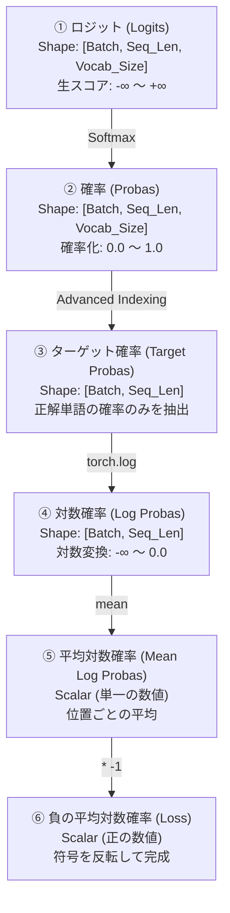

# 損失を計算する6つのステップ (図5-7の解説)

書籍144ページの**「図5-7：損失を計算する6つのステップ」**は、モデルが出力した予測スコア（ロジット）から、学習の成否を測る指標である「損失 (Loss)」を算出するまでのデータ処理フローを示しています。

この処理の本質は、数学的には **「クロスエントロピー損失 (Cross Entropy Loss)」** の計算そのものです。6つのステップそれぞれの意味と、裏側にある数学的な動機について詳しく解説します。

---

## 1. 損失計算の全体データフロー

モデルの出力から最終的なLoss値が計算されるまでのフローです。



---

## 2. 各ステップの詳細解説

### ① ロジット (Logits)
*   **値の例**: `[[[0.1113, -0.1057, -0.3666, ...]]]`
*   **意味**: モデルの最終層（線形出力層）から出力された、各単語に対する「生の予測スコア」です。プラスやマイナスのあらゆる実数値を取ります。まだ「確率（％）」にはなっていません。

### ② 確率 (Probas)
*   **値の例**: `[[[1.8849e-05, 1.5172e-05, 1.1687e-05, ...]]]`
*   **意味**: ロジットに **`Softmax` 関数**を適用した結果です。すべての値が `0.0` 〜 `1.0` の範囲に収まり、各位置の全単語の合計値がちょうど `1.0` (100%) になるよう変換されます。

### ③ ターゲット確率 (Target Probas)
*   **値の例**: `[7.4541e-05, 3.1061e-05, 1.1563e-05, ...]`
*   **意味**: 50,257個ある全単語の確率の中から、**「その位置における『正解の単語』の確率」だけをピンポイントで抜き出したもの**です。
*   **コードでの実現**: 以下の「アドバンスト・インデキシング」を使って抽出します。
    ```python
    target_probas = probas[batch_idx, [0, 1, 2], targets[batch_idx]]
```

### ④ 対数確率 (Log Probas)
*   **値の例**: `[-9.5042, -10.3796, -11.3677, ...]`
*   **意味**: ターゲット確率に自然対数（`torch.log`）を掛けたものです。確率は `0` 〜 `1` のため、対数をとると必ず `マイナス（負）の値` になります（正解確率1.0の時は `0`、0.0に近づくほど $-\infty$ に向かって激しく小さくなります）。
*   **💡 なぜ対数 (Log) を取るのか？**:
    1.  **アンダーフローの防止**: 各トークンの予測確率を掛け合わせて「文章全体の正解確率」を出そうとすると、例えば $0.01 \times 0.02 \times 0.005 \dots$ のように掛け算の繰り返しで数値が極小になり、コンピュータが扱いきれずにゼロに潰れてしまいます（アンダーフロー）。対数を取ることで、**「掛け算」を「足し算」で計算できる**ようになり、安全に処理できます。
    2.  **大ハズレへの厳しいペナルティ**: 確率が $1.0$ (正解) に近ければ対数は $0$ に近くほぼ無風ですが、確率が $0.0$ に近づくと、対数グラフはマイナス無限大（$-\infty$）に向かって急激に落下します。これにより、モデルが大きく予測を外した時に強烈なペナルティ（Loss）を与えることができます。

### ⑤ 平均対数確率 (Mean Log Probas)
*   **値の例**: `-10.7940`
*   **意味**: 取り出した各位置の対数確率をすべて足し合わせて、予測の個数で割った平均値です。

### ⑥ 負の平均対数確率 (Negative Log Likelihood / Loss)
*   **値の例**: `10.7940`
*   **意味**: 平均対数確率に **$-1$ を掛け算してプラスの数値に反転**させたものです。これが最終的な「損失 (Loss)」になります。
*   **💡 なぜマイナスにするのか？**:
    数学的に、モデルの目的は「正解の確率を**最大化**すること」です。しかし、機械学習のオプティマイザ（Adam等）は「目標の値を**最小化**する（誤差を減らす）」ようにしか設計されていません。
    そのため、確率の符号を反転させることで、**「正解確率を最大化する」という問題を「損失を最小化する」という問題にすり替える**ためにマイナスを掛けます。

---

## 3. なぜ損失計算の前に「フラット化（平坦化）」が必要なのか？

書籍やコードの中で、`cross_entropy` を計算する直前に必ず以下のフラット化（次元の平坦化）の処理が行われています。

```python
logits_flat = logits.flatten(0, 1)
targets_flat = targets.flatten()

print("Flattened logits:", logits_flat.shape)   # 例: torch.Size([6, 50257])
print("Flattened targets:", targets_flat.shape) # 例: torch.Size([6])
```

### ❓ フラット化を行う本質的な理由

#### 1. PyTorchの損失関数 (`cross_entropy`) の仕様上のルール
PyTorchに標準搭載されている `cross_entropy` 関数は、画像分類などのシンプルなタスクのために作られているため、以下の次元形式でデータを入力することを要求します。

*   **ロジット (入力)**: `[データ件数, クラス数（単語の選択肢数）]` （2次元）
*   **ターゲット (正解)**: `[データ件数]` （1次元）

#### 2. LLMデータの次元のミスマッチ
しかし、LLMで扱うテンソルは、バッチ処理と時系列（文章長）があるため、次元が1つ多くなっています。

*   **元の logits**: `[バッチサイズ, 文章の長さ, 語彙数]` (例: `[2, 3, 50257]`)
*   **元の targets**: `[バッチサイズ, 文章の長さ]` (例: `[2, 3]`)

このままでは `cross_entropy` に渡せないため、**「バッチという外枠」と「時系列という区切り」を一時的に取っ払い、すべての予測位置を1列に縦積みにして結合する**必要があります。

#### 3. 形状変化のビジュアルイメージ

`[Batch=2, Seq_Len=3]` のデータ（計6つの単語予測位置）を平坦化する場合：

```text
【元のテンソル (3次元)】
Batch 0 / Seq 0  ─┐
Batch 0 / Seq 1  ─┼─> (バッチと時系列で区切られている)
Batch 0 / Seq 2  ─┘
Batch 1 / Seq 0  ─┐
Batch 1 / Seq 1  ─┼─>
Batch 1 / Seq 2  ─┘
        ↓
【フラット化 (2次元・1次元に縦積み結合)】
行 0 : [ 0.33, -0.17, ...] (Batch 0 / Seq 0) ──> 正解ID: 2
行 1 : [  0.66, -0.21, ...] (Batch 0 / Seq 1) ──> 正解ID: 4
行 2 : [  0.69, -1.40, ...] (Batch 0 / Seq 2) ──> 正解ID: 1
行 3 : [ -1.60, -1.32, ...] (Batch 1 / Seq 0) ──> 正解ID: 0
行 4 : [ -0.38, -0.93, ...] (Batch 1 / Seq 1) ──> 正解ID: 3
行 5 : [  1.55,  0.62, ...] (Batch 1 / Seq 2) ──> 正解ID: 2
```

このように `flatten` をかけることで、PyTorchの内部では「時系列やバッチといった複雑な関係」を気にすることなく、単に **「6つの独立した予測問題について、それぞれ50,257個の選択肢から正解を当てる多クラス分類問題」** として一括で非常に高速に誤差を計算できるようになります。

---

## 4. 実践のコードでのショートカット

実際の PyTorch のコードでは、この①〜⑥を手動で書くのではなく、フラット化したデータを **`torch.nn.functional.cross_entropy`** に一発で渡して処理します。

```python
# 実践での書き方
loss = torch.nn.functional.cross_entropy(logits_flat, targets_flat)
```

この組み込み関数は、ロジットから直接計算を行うため、Softmaxの段階での数値の指数爆発（オーバーフロー）を防ぎながら、全く同じ計算結果を高速に出力してくれます。

---

## 📂 関連ファイルリンク
*   **損失計算の6ステップ実証シミュレーター**: [loss_calculation_demo.py](../basics/loss_calculation_demo.py)
    （書籍の図5-7と全く同じ6つのステップをPyTorchで手動実装し、PyTorch公式の `cross_entropy` と誤差 $0.0$ で完全一致することを実演するコードです）
