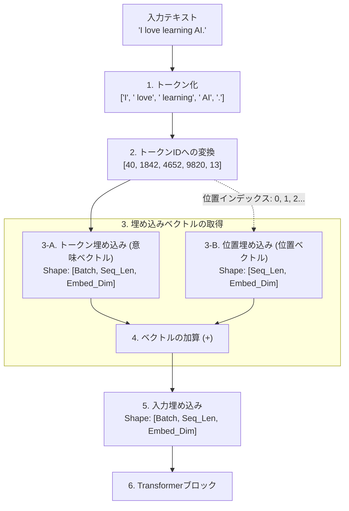

# LLM入力処理パイプライン：入力埋め込み (Input Embedding) のメカニズム

LLM（Large Language Models）はテキストデータをそのまま処理することができないため、テキストを連続的な数値ベクトルに変換する必要があります。この変換プロセスを入力処理パイプライン、または**入力埋め込み（Input Embedding）**と呼びます。

以下は、入力されたテキストがTransformerモデルに入力可能なテンソルへと変換されるプロセスの概念図と詳細です。

---

## 1. 処理プロセスの概念図

以下のダイアグラムは、テキスト `"I love learning AI."` を処理する際の入力パイプラインの流れを示しています。



---

## 2. 各ステップの詳細解説

### 1. トークン化 (Tokenization)
Rawテキストを「トークン」と呼ばれる処理単位に分割します。トークナイザー（BPEやWordPieceなど）を使用し、単語、単語の一部（サブワード）、あるいは記号に細分化します。
*   **例**: `"I love learning AI."` $\rightarrow$ `['I', ' love', ' learning', ' AI', '.']`

### 2. トークンIDへの変換 (Vocabulary Mapping)
あらかじめ用意された語彙辞書（Vocabulary）をルックアップし、各トークンを一意の整数IDにマッピングします。
*   **例**: `['I', ' love', ' learning', ' AI', '.']` $\rightarrow$ `[40, 1842, 4652, 9820, 13]`

### 3-A. トークン埋め込み (Token Embedding)
トークンID（整数）を、そのトークンの「意味」を表現する高次元の浮動小数点ベクトルに変換します。
*   PyTorch では `nn.Embedding` レイヤを使用して行います。これは、IDを行インデックスとする巨大なルックアップテーブル（重み行列）として機能します。
*   例えば、GPT-2モデルでは各トークンが **768次元** のベクトルに表現されます。

### 3-B. 位置埋め込み (Positional Embedding)
Transformerモデルは入力トークンの「順序」や「位置」を自己注意機構（Self-Attention）だけで捉えることができないため、位置情報を明示的に与える必要があります。
*   トークンが文の何番目に位置するか（インデックス `0, 1, 2, ...`）に応じて、トークン埋め込みと同じ次元数（例: 768次元）の位置ベクトルを作成します。
*   GPTモデル（絶対位置埋め込み）では、トークン埋め込みと同様に `nn.Embedding` を用いて位置インデックスから位置ベクトルを学習します。

### 4. ベクトルの加算
取得した「トークン埋め込みベクトル」と「位置埋め込みベクトル」を要素ごとに足し合わせます（要素ごとの加算 / Element-wise Addition）。
*   **計算**: $\text{Input Embedding} = \text{Token Embedding} + \text{Positional Embedding}$
*   これにより、単語の持つ「意味」と、その単語が文中の「どこにあるか」という2つの情報が一つのベクトルに統合されます。

### 5. 入力テンソルの完成
加算されたベクトルがLLM（Transformerブロック）の最初のレイアに入力されます。

---

## 3. 【補足】One-hot（ワンホット）表現と Embedding（埋め込み）の数学的関係

テキストIDをベクトルに変換するプロセスを考える上で、避けて通れないのが「One-hot表現（One-hotベクトル / One-hot行列）」と「Embedding（埋め込み）」の関係性です。

### ① One-hot（ワンホット）表現とは？
「一つだけ（One）が熱い（Hot = 1）、他は冷めている（0）」という意味のデータ表現方法です。

語彙（辞書）全体のサイズ（例: 語彙数 $V=4$）と同じ長さのベクトルを用意し、**該当する単語のIDに対応するインデックス位置だけを `1` にし、他をすべて `0`** にしたベクトル（One-hotベクトル）で単語を表します。

*   **例**: 語彙辞書が `["I", "love", "learning", "AI"]` （語彙数 4）のとき
    *   `"I"` (ID: 0) $\rightarrow$ `[1, 0, 0, 0]`
    *   `"love"` (ID: 1) $\rightarrow$ `[0, 1, 0, 0]`
    *   `"AI"` (ID: 3) $\rightarrow$ `[0, 0, 0, 1]`

これを文（単語のシーケンス）に適用し、各単語のOne-hotベクトルを縦に積み重ねたものを **One-hot 行列** と呼びます。

*   **例**: `"I love AI"` （ID列: `[0, 1, 3]`）のOne-hot行列 $X_{\text{one\_hot}}$
    ```text
    [
      [1, 0, 0, 0],  # "I" の One-hotベクトル
      [0, 1, 0, 0],  # "love" の One-hotベクトル
      [0, 0, 0, 1]   # "AI" の One-hotベクトル
    ]
    ```
    この時の行列の形状は `[入力トークン数, 語彙数]`（例: `[3, 4]`）になります。

### ② Embedding重み行列 $W_E$ との掛け算
`nn.Embedding` レイヤーの内部には、各単語の分散表現（意味ベクトル）を行として格納した、巨大な **「Embedding重み行列 $W_E$」**（形状: `[語彙数, 埋め込み次元]`）が保持されています。

数学的には、単語に対応する埋め込みベクトルを取り出すという操作は、**「One-hotベクトル（または行列）と Embedding重み行列 $W_E$ の行列積（掛け算）」と完全に同一**になります。

$$\text{Embedding Vector} = X_{\text{one\_hot}} \times W_E$$

#### 📊 行列計算のイメージ（語彙数4、次元数3の場合）
```text
  One-hot行列 [3, 4]              Embedding重み行列 [4, 3]        抽出された意味ベクトル [3, 3]
  ┌───────────────┐               ┌─────────────────────┐         ┌─────────────────────┐
  │ 1   0   0   0 │ ("I")         │  0.25   0.88  -0.14 │ (ID:0)  │  0.25   0.88  -0.14 │ ("I"のベクトル)
  │ 0   1   0   0 │ ("love")   ×  │ -0.66   0.02   0.45 │ (ID:1)  = │ -0.66   0.02   0.45 │ ("love"のベクトル)
  │ 0   0   0   1 │ ("AI")        │  0.11  -0.34   0.98 │ (ID:2)  │  0.88   0.12   0.77 │ ("AI"のベクトル)
  └───────────────┘               │  0.88   0.12   0.77 │ (ID:3)  └─────────────────────┘
                                  └─────────────────────┘
```
このように、One-hot行列の各行にある `1` の位置に対応する重み行列の行（意味ベクトル）が、行列の掛け算によってそのままフィルタリング（抽出）されて出力されます。

### ③ なぜ実際のプログラムでは One-hot 行列を掛け算しないのか？ (Lookupハック)
数学の定義上は「One-hot行列と重み行列の掛け算（行列積）」ですが、実際のモデルでこれを忠実に計算しようとすると、非常に効率が悪くなります。

なぜなら、実際のLLMの語彙数は **数万語〜数十万語** に達するためです。
例えば、語彙数が `50,000` で、入力文が `10` トークンの場合、One-hot行列のサイズは `[10, 50000]` という巨大なサイズになります。その中身の **99.9% は単なる `0`** です（スパース行列）。

このような巨大な `0` だらけの行列を掛け算することは、計算機にとっては「膨大な数の `0` を掛け算して足す」という完全に無駄なループ処理を回すことになり、メモリと処理速度を壊滅的に浪費します。

そこで、PyTorchの `nn.Embedding` は以下のハックを行っています。

*   **💡 Lookup（ルックアップ）による高速化**:
    数式上の掛け算は一切行わず、**「単語ID（整数）を配列のインデックス（住所）として使い、重み行列 $W_E$ から対応する行を一瞬で直接引っこ抜く（Lookup）」** という処理を行っています。

これにより、計算コストをほぼゼロにし、メモリ消費を最小限に抑えながら、行列積と同じ結果を瞬時に得られるように最適化されています。

---

## 4. 実実装コードとの対応

このリポジトリの [make-embedding.py](file:///c:/Users/owner/Documents/lab/Antigravity/python-learn/pytorch-llm/make-embedding.py) では、このパイプラインが以下のようにPyTorchで実装されています。

```python
# 1. 埋め込みレイヤの定義 (nn.Embedding)
# token_embedding: 語彙数から埋め込み次元(768)へのマッピング
self.token_embeddings = nn.Embedding(vocab_size, output_dim)
# pos_embedding: コンテキストの最大長(1024)から埋め込み次元(768)へのマッピング
self.pos_embeddings = nn.Embedding(context_length, output_dim)

# 2. 順伝播 (forward) での加算
def forward(self, x):
    # token_embeddings の取得
    token_embeds = self.token_embeddings(x)
    # 位置インデックスに対応する pos_embeddings の取得
    pos_embeds = self.pos_embeddings(torch.arange(x.shape[1], device=x.device))
    
    # 両者を加算して入力埋め込みを作成
    return token_embeds + pos_embeds
```

---

## 4. 出典・参考情報

*   **参考図書**: Sebastian Raschka 著『LLMs from Scratch』（邦題：『つくりながら学ぶ！LLM自作入門』）の「図2-19: 入力処理パイプライン」の概念より着想。
*   **本ドキュメントの位置付け**: 上記書籍の概念をベースに、独自の例文（`I love learning AI.`）と独自の図式レイアウト（Mermaidフロー）を用いて理解を整理した証跡です。
