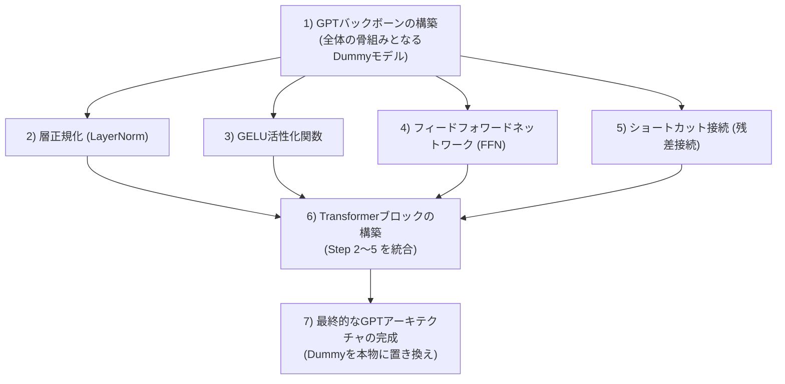
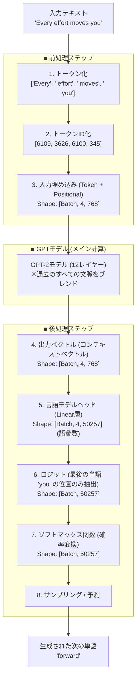
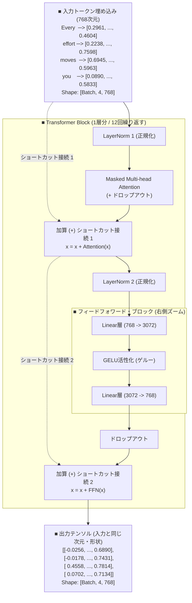

# GPTモデルのアーキテクチャ構成とデータフロー

このドキュメントでは、書籍『つくりながら学ぶ！LLM自作入門』の第4章で解説されているGPTモデル（GPT-2ベース）の全体構成、データやテンソルが処理されるフロー、開発プロセスで登場する「プレースホルダ」の役割、PyTorchの「`nn.Embedding` の仕組み」、および「トランスフォーマーブロック」の内部構造について、ビジュアル図解（Mermaid）を交えて体系的に解説します。

---

## 1. GPTアーキテクチャを実装する7つのステップ

GPTモデル（GPT-2など）を一から構築する際、コードが複雑化してデバッグが困難になるのを防ぐため、段階的にパーツを実装していくアプローチが取られます。



各ステップの詳細は以下の通りです。
1.  **GPTバックボーンの構築（プレースホルダ）**: まずモデル全体のデータの流れ（入力から出力まで）を定義する「仮の骨組み（DummyGPTModel）」を作ります。
2.  **層正規化（LayerNorm）**: 訓練を安定させ、収束を早めるための正規化手法を実装します。
3.  **GELU活性化関数**: 非線形性を追加するための活性化関数（GELU: Gaussian Error Linear Unit）を実装します。
4.  **フィードフォワードネットワーク（FFN）**: 各トークン表現を射影・変換するための全結合層の組み合わせを実装します。
5.  **ショートカット接続（残差接続）**: 勾配消失を防ぎ、深いネットワークでも学習が進むようにするためのバイパス経路を実装します。
6.  **Transformerブロック**: 2〜5の部品と、以前実装した「Multi-Head Attention」を組み合わせて、トランスフォーマーの基本処理単位（ブロック）を作成します。
7.  **最終的なGPTアーキテクチャ**: 最初に作った `DummyGPTModel` の中身を、完成した本物の `TransformerBlock` や `LayerNorm` に置き換え、実際にテキスト生成が可能なモデルを完成させます。

---

## 2. プレースホルダ（Placeholder）とは？

書籍の中で `DummyGPTModel`、`DummyTransformerBlock`、`DummyLayerNorm` といったクラスが登場します。これらは**「プレースホルダ（仮置き場）」**と呼ばれる実装アプローチです。

### プレースホルダの役割
> [!NOTE]
> プレースホルダとは、**「全体の構造や入出力の流れを定義するために、一時的に配置する中身のない（または最小限の処理しかしない）ダミーのプログラム」**のことです。

例えば、書籍で定義される `DummyTransformerBlock` は以下のようになっています。

```python
class DummyTransformerBlock(nn.Module):
    def __init__(self, cfg):
        super().__init__()
        # 本物はここに複雑なAttentionやFFNを配置するが、
        # プレースホルダでは何も初期化しない

    def forward(self, x):
        return x  # 入力をそのまま出力するだけ
```

### なぜプレースホルダを使用するのか？
1.  **データフロー（Shape）の疎通確認**:
    LLMの実装で最も発生しやすいエラーは、テンソルのサイズ（Shape）の不一致です。プレースホルダを使用することで、複雑な計算を行う前に「入力されたデータが、期待したサイズで最後まで流れて出力されるか」を検証できます。
2.  **トップダウン設計**:
    全体の骨組み（モデルの入力・埋め込み・出力ヘッド・最終正規化などの流れ）を最初に確定させることで、これからどの部品をどういうインターフェース（入力と出力の仕様）で作ればよいのかが明確になります。

---

## 3. テキスト予測の全体データフロー (図4-4の独自再構成)

入力テキスト `"Every effort moves you"` から、モデルが次の単語 `"forward"` を予測・生成するまでのデータとテンソルの旅を示します。



### 💡 LLM特有の重要ルール：「入力数 ＝ 出力数」の制約
LLM（Transformerデコーダー）は、シーケンス（文）全体を一括で並列計算するため、**「入力されたトークンの数」と「最終的に出力されるコンテキストベクトルの数」は常に完全に一致**します。

今回は4つのトークンを入力したため、出力ベクトルも4つ生成されます。各位置における出力は、**「その位置での次のトークンの予測」**を担っています。

*   `"Every"` の位置の出力 $\rightarrow$ 次の単語 `"effort"` の予測に対応
*   `"effort"` の位置の出力 $\rightarrow$ 次の単語 `"moves"` の予測に対応
*   `"moves"` の位置の出力 $\rightarrow$ 次の単語 `"you"` の予測に対応
*   **`"you"`（最後の単語）の位置の出力 $\rightarrow$ 新たな次の単語 `"forward"` の予測に対応（本当に欲しい結果）**

したがって、文の続きを生成する際は、**「出力テンソルの最後の一行（最後の単語の位置のロジット）」だけを引っこ抜いて**、次の単語のサンプリングに使用します。

---

## 4. `nn.Embedding` とは何か？

`nn.Embedding` は、PyTorchが提供する**「離散的なトークンID（整数）を、高次元の分散表現ベクトル（実数）に変換するためのレイヤー」**です。

### 基本的な仕組み
`nn.Embedding` は、本質的には**巨大なルックアップテーブル（重み行列）**です。
- **入力**: トークンIDのテンソル。Shapeは `[BatchSize, SeqLen]`（整数型）。
- **出力**: 埋め込みベクトルのテンソル。Shapeは `[BatchSize, SeqLen, EmbedDim]`（浮動小数点数型）。

例えば、語彙数（`vocab_size`）が 50,257、埋め込み次元（`emb_dim`）が 768 の場合、`nn.Embedding(50257, 768)` は内部に `[50257, 768]` の大きさの学習可能な重み行列を持っています。

```
トークンID: [ 40 ]  ---> nn.Embeddingルックアップ ---> 行インデックス40のベクトルを取得
                                                [0.12, -0.45, ..., 0.98] (768次元)
```

詳細な仕組みや、One-hot行列との数学的関係については、[embedding_mechanism.md](./embedding_mechanism.md) を参照してください。

---

## 5. トランスフォーマーブロック内部のデータフロー (図4-13の完全再現)

GPTモデルの核となる「Transformerブロック」のデータフローを示します。GPT-2では、各モジュール（AttentionやFFN）の前に層正規化（LayerNorm）を適用する **Pre-LayerNorm** 方式が採用されています。

以下の図は、書籍119ページの**「図4-13：Transformerブロック」**に対応するテンソルとデータの流れを詳細に再構成したものです。



### ⚙️ 内部処理のステップ解説

1.  **LayerNorm (レイヤー正規化)**:
    各トークンベクトルの平均を0、分散を1に標準化し、ニューラルネットワークの深層学習を安定させます。
2.  **Causal Multi-Head Attention (アテンション)**:
    未来の単語を見ないようにマスク（Causal Mask）を掛けつつ、複数のヘッド（脳）が並列で動き、過去の単語から「どの情報をどれくらい取り込むか」を計算して文脈をブレンドします。
3.  **残差接続 1 (Residual Connection / Shortcut)**:
    アテンション前の「元のデータ」を、アテンション後のデータにそのまま足し合わせます。これにより、層がどれだけ深くなっても勾配（学習のヒント）が消滅するのを物理的に防ぎます。
4.  **Feed-Forward Network (FFN)**:
    トークン（単語）ごとに個別に全結合層を通し、一度特徴量を4倍（768 $\rightarrow$ 3072次元）に広げてから、**GELU活性化関数**（非線形変換）を掛け、再び元の768次元に戻します。これによって、モデルの表現力（複雑なうねりを表現する実力）を大きく高めます。
5.  **残差接続 2**:
    FFN前のデータをFFN後のデータに足し合わせ、情報の損失を防ぎます。
6.  **LM Head（言語モデルヘッド）**:
    $N$ 個（GPT-2では12層）のブロックを通過して、文脈情報を極限まで吸収した出力ベクトル（768次元）に対し、最後に `nn.Linear` を適用して、語彙数と同じ次元（`50,257`）の数値のリスト（**ロジット**）に変換し、次の単語予測へと繋げます。

---

## 6. まとめと学習のためのファイルリンク

関連する学習用スクリプトや他のドキュメントへのリンクです。併せて参照すると理解が深まります。

- **テンソルの基本操作**: [pytorch_tensor_operations.md](./pytorch_tensor_operations.md)
- **入力埋め込みの詳細**: [embedding_mechanism.md](./embedding_mechanism.md)
- **Embeddingのデモコード**: [embedding_demo.py](../basics/embedding_demo.py)
