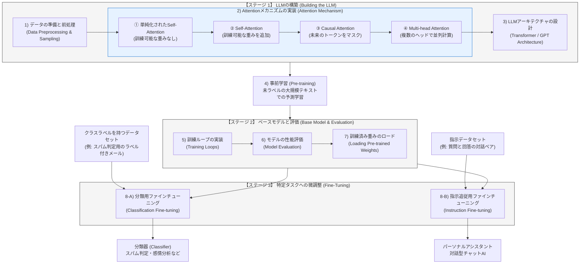

# LLM構築ライフサイクル：開発の3つのステージ

LLM（大規模言語モデル）を一から構築し、特定のアプリケーションに適用するまでの全体像を示す開発ステージマップです。
本リポジトリでの学習・実装は、このロードマップに基づいて進めていきます。

---

## 🗺️ LLM構築の全体図 (図3-13に基づく詳細版)

以下のダイアグラムは、スクラッチからLLMを構築し、最終的に特定のアプリケーション（分類器やアシスタント）へ適用するまでの全プロセスを整理したものです。
アテンション機構（ステップ2）の内部進化プロセスについても詳細化しています。

---

## 📝 各ステージの解説

### 【ステージ 1】 LLMの構築
モデルの「肉体」を作るフェーズです。テキストデータを数値に変換するトークナイザーから、文脈を捉えるアテンション機構、そしてそれらを結合したGPTモデルのアーキテクチャそのものをコードで構築します。
特に**「Attentionメカニズム（2）」**は、重みなしの極小アプローチから始まり、学習可能な重みの追加、生成時の未来情報の制限（Causal）、マルチヘッド化へと段階的に進化させていきます。

### 【ステージ 2】 ベースモデルと評価
モデルを「学習・訓練」させるフェーズです。言語モデルの予測精度を高めるためのループを設計・評価します。また、自分で巨大な学習を行う代わりに、オープンソースの学習済みパラメータを自分で構築したモデル構造に読み込む方法もここで学びます。

### 【ステージ 3】 特定タスクへの微調整 (ファインチューニング)
ベースモデルは「次の単語を予測すること」しかできません。これを、スパムメールを判定する「分類器」や、対話形式でユーザーの指示に従う「チャットアシスタント」へ変化させるため、専用のデータセットを用いてさらに追加学習（チューニング）を行います。

---

## 📄 出典・参考情報

*   **参考図書**: Sebastian Raschka 著『LLMs from Scratch』（邦題：『つくりながら学ぶ！LLM自作入門』）の「図3-13: Self-AttentionメカニズムがLLMの実装という広いコンテキストの中でどのように位置付けられるか」の概念より着想。
*   **本ドキュメントの位置付け**: 上記書籍の全体設計図をベースに、独自のMermaidフロー図と解説を用いて学習マイルストーンを整理したものです。
