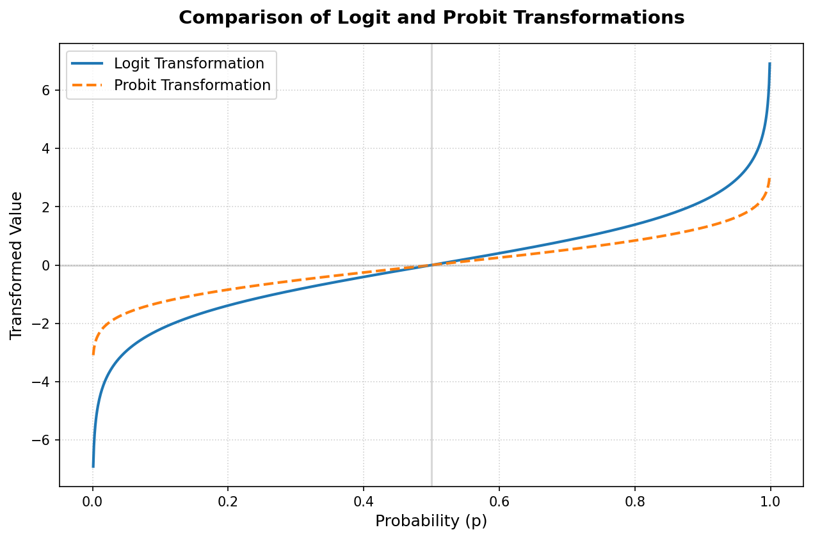

# ロジット・プロビット変換の解説と実装

**ロジット変換（Logit Transformation）**と**プロビット変換（Probit Transformation）**は、いずれも **0から1の範囲の数値（主に確率 $p$）を、実数全体（$-\infty$ から $\infty$）の範囲に写像する（変換する）手法**です。

統計学では、二値分類（Yes/No、生存/死亡など）の確率を線形モデルで予測する「ロジスティック回帰（ロジットモデル）」や「プロビット回帰（プロビットモデル）」の基礎として用いられます。

---

## 1. 変換の数式と定義

### ① ロジット変換 (Logit)
確率 $p \in (0, 1)$ に対して、オッズ（Odds: $\frac{p}{1-p}$）の対数をとったものです。

$$\text{logit}(p) = \log\left(\frac{p}{1-p}\right)$$

* **逆変換（ロジスティック関数 / シグモイド関数）**:
  実数 $x$ を確率 $p$ に戻す変換です。深層学習で非常によく使われます。
  $$p = \sigma(x) = \frac{1}{1 + e^{-x}}$$

### ② プロビット変換 (Probit)
確率 $p \in (0, 1)$ に対し、**標準正規分布の累積分布関数（CDF: Cumulative Distribution Function）の逆関数**を適用する変換です。

$$\text{probit}(p) = \Phi^{-1}(p)$$

ここで、$\Phi(x)$ は標準正規分布（平均0、分散1）の累積分布関数です。

* **逆変換（標準正規分布の累積分布関数）**:
  $$p = \Phi(x) = \frac{1}{\sqrt{2\pi}} \int_{-\infty}^{x} e^{-\frac{t^2}{2}} dt$$

---

## 2. 視覚的比較

ロジット変換とプロビット変換は、定数倍（プロビットを約1.6〜1.7倍するとロジットに近くなる）することで非常によく似た形状になります。



> [!NOTE]
> **形状の違いと特徴**
> * **ロジット**: 裾野（確率が0や1に非常に近い部分）がプロビットに比べて緩やかにゼロ/無限大に近づきます（重い裾）。数式がシンプルで計算負荷が低いため、機械学習や深層学習で広く好まれます。
> * **プロビット**: 裾野が急速に減衰します。潜在的な変数（アンケートの回答閾値など）に正規分布を仮定できるような経済学やバイオアッセイの分野で好んで使われます。

---

## 3. バイオアッセイ（生物学的測定法）における応用と歴史

プロビット変換は、歴史的に**バイオアッセイ（生物検定法）**のデータ解析のために考案されました。

### ① バイオアッセイとは？
化学物質や医薬品などの「生物への作用（毒性や薬効の強さ）」を、実際の生物（細胞、昆虫、マウスなど）の反応を利用して測定・評価する手法です。

### ② 用量反応関係とプロビット
薬や毒の投与量（用量）を増やしていくと、反応する個体の割合（確率 $p$）はS字カーブを描いて増加します。
この関係を数式モデル（用量反応曲線）として解析する際、1930年代に C. I. Bliss によって開発されたのが **プロビット分析（Probit Analysis）** です（Probit は **Prob**ability un**it**「確率単位」の略）。

プロビット変換を行うことで、S字型の用量反応曲線を直線関係に直すことができ、統計的に**「50%の個体が死亡する用量（LD50: 半数致死量）」**や**「50%の個体に効果がある用量（ED50: 半数有効量）」**を正確に算出できるようになりました。

---

## 4. LLMや深層学習との関連性

LLMやニューラルネットワークの文脈でも、これらの概念は形を変えて頻繁に登場します。

### ① 「ロジット（Logits）」という言葉の由来
LLMの最終層（Softmaxを適用する直前）の出力値ベクトルのことを **Logits（ロジット）** と呼びます。
これは、Softmaxを適用して得られる確率分布 $p_i$ に対して、分類器の出力が「対数オッズ（Log-Odds）」に相当する役割を持っていることから名付けられました。

### ② GELU活性化関数とプロビット（正規分布CDF）
近年、GPTやBERTなどのLLMのフィードフォワードネットワーク（FFN）で標準的に使われている活性化関数 **GELU (Gaussian Error Linear Unit)** は、プロビットの逆変換である**標準正規分布の累積分布関数 $\Phi(x)$** を利用しています。

$$\text{GELU}(x) = x \Phi(x) = x \cdot P(X \le x), \quad X \sim \mathcal{N}(0, 1)$$

---

## 5. Pythonプログラムでの実装例

Pythonでこれらの変換および逆変換を実装する場合、`numpy` と `scipy.stats` を使用するのが最も一般的です。
（詳細な実装とデモスクリプトは [logit_probit_demo.py](../basics/logit_probit_demo.py) に記述されています）

```python
import numpy as np
from scipy.stats import norm

# ロジット変換: 確率 p (0 ~ 1) を実数 (-inf ~ inf) に変換
def logit(p):
    p = np.clip(p, 1e-15, 1 - 1e-15)  # エラー防止用クリップ
    return np.log(p / (1 - p))

# 逆ロジット変換（シグモイド関数）
def inverse_logit(x):
    return 1 / (1 + np.exp(-x))

# プロビット変換
def probit(p):
    p = np.clip(p, 1e-15, 1 - 1e-15)
    return norm.ppf(p)  # 累積分布関数の逆関数 (Percent Point Function)

# 逆プロビット変換
def inverse_probit(x):
    return norm.cdf(x)  # 標準正規分布の累積分布関数
```
