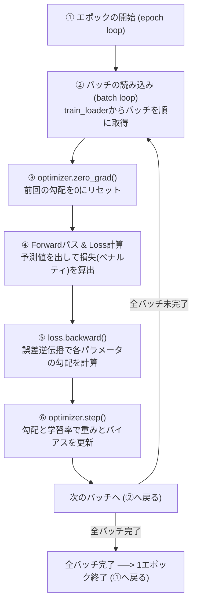

# PyTorchの訓練ループとエポック・バッチの数理 (図5-11の解説)

書籍154ページの**「図5-11：PyTorchでディープニューラルネットワークを訓練するための一般的な訓練ループ」**は、モデルにデータを読み込ませ、重みパラメータを更新していく最小の処理単位とサイクルを示しています。

「エポック」「バッチ」の正しい概念整理と、訓練ループで実行されるPyTorchの基本コード（`zero_grad()`, `backward()`, `step()`）の裏側の仕組みを解説します。

---

## 1. 概念整理：エポック、バッチ、ステップの違い

モデルの学習では、データを小分けにしながら何度も繰り返し学習させます。この時の単位の階層関係は以下のようになります。

| 単位 | 意味 | LLM（GPT）での具体例 |
| :--- | :--- | :--- |
| **エポック (Epoch)** | 訓練データセットの**すべてのデータ**が、ちょうど1回丸ごとモデルを通過すること。 | データセットに含まれるすべての本やWebテキストを1回読み終えた状態。 |
| **バッチ (Batch / Mini-batch)** | 全データを一括処理するとメモリ不足になるため、並列処理しやすいように小分けにした**データの塊（束）**。 | バッチサイズを 2 とした場合、一度に2つの文章を並列処理する塊。 |
| **ステップ / イテレーション (Step / Iteration)** | 1つのバッチを入力して Loss を計算し、**パラメータを1回更新する最小のアクション**。 | 2つの文章を処理し、モデルの重みを1回微修正する処理。 |

### 🧮 階層関係の数理例
*   **全体の訓練データ数**: $1,000$ 件
*   **バッチサイズ (Batch Size)**: $100$ 件
*   このとき、全データは $1,000 \div 100 = 10$ 個のバッチに分割されます。

$$1 \text{ エポック} = 10 \text{ バッチの処理 (10ステップ分のパラメータ更新)} \text{ の完了}$$

したがって、**「各エポックの中で、すべてのバッチが順番に余さず処理される」**ことになります。

---

## 2. 訓練ループのデータフロー (図5-11のMermaid図)

PyTorchで記述される一般的な訓練ループの構造です。



---

## 3. PyTorchの4大基本ステップの役割

訓練ループ内の各コードが何をしているかを数理的に説明します。

```python
# 実際の PyTorch 訓練ループのコア部分
for input_batch, target_batch in train_loader:
    optimizer.zero_grad()                                      # (A)
    loss = calc_loss_batch(input_batch, target_batch, model)   # (B)
    loss.backward()                                            # (C)
    optimizer.step()                                           # (D)
```

### (A) `optimizer.zero_grad()` ── 勾配のリセット
*   **役割**: 各パラメータの内部に保管されている「前回の勾配（`.grad`）」の数値を `0` にクリアします。
*   **💡 なぜ毎回リセットが必要なのか？**:
    PyTorchの仕様では、`backward()` を呼んだときに計算される勾配は、自動的に既存の `.grad` に **加算（累積）** されていきます（RNNなどの特殊なモデルで勾配を貯めるための仕様です）。
    もし `zero_grad()` を呼ぶのを忘れると、**「前回のバッチで計算した古い勾配」の上に「今回のバッチの勾配」が足し算**されてしまい、モデルの重みが間違った方向へ暴走して学習が完全に崩壊します。そのため、新しいバッチの処理を開始する瞬間に、必ず黒板を消すようにゼロリセットします。

### (B) `loss = calc_loss_batch(...)` ── 順伝播 (Forward) と損失計算
*   **役割**: 入力データをモデルに通して予測スコア（ロジット）を作り、正解ラベルと比較して「現在のモデルの予測がどれくらい外れているか」のペナルティ値（Loss）を計算します。

### (C) `loss.backward()` ── 逆伝播 (Backward)
*   **役割**: 計算された Loss を元に、出力層から入力層に向かって微分を逆伝播させ、すべてのパラメータ（重みとバイアス）について、**「Lossを減らすために、今の状態からどの方向にどれくらい数値を動かせばよいか」という微調整の方向と量（勾配：Gradient）**を計算し、各パラメータの `.grad` 変数に格納します。
*   ※この段階では、まだパラメータの「値自体」は変わりません。

### (D) `optimizer.step()` ── パラメータ更新
*   **役割**: `backward()` で計算された勾配（`.grad`）と、設定された「学習率 (Learning Rate: $\eta$)」を元に、実際のパラメータの値を書き換えます。
*   **更新の数理式** (最も単純なSGDの場合):

$$\text{重み} \leftarrow \text{重み} - (\text{学習率} \times \text{勾配})$$

これによってモデルが少しだけ「正解に近い予測ができる重み」に変化し、1ステップが完了します。これを全バッチ、全エポックで繰り返すことで、モデルは少しずつ賢くなっていきます。

---

## 📂 関連ファイルリンク
*   **訓練ループ動作実証シミュレーター**: [training_loop_demo.py](../basics/training_loop_demo.py)
    （非常にシンプルな1次関数の予測モデルを用いて、`zero_grad()`, `backward()`, `step()` を踏むたびに、パラメータの値と勾配が内部でどう変動しているかを1ステップずつ数値出力して実演するデモコードです）
