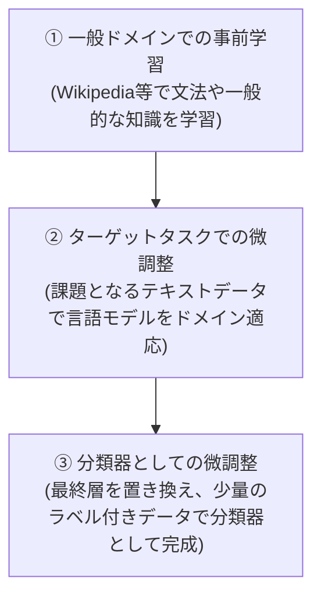

# 転移学習（Transfer Learning）と ULMFiT の解説

自然言語処理（NLP）および大規模言語モデル（LLM）の発展において、**転移学習（Transfer Learning）**とそれを実用化した**ULMFiT**は非常に重要な技術的マイルストーンです。

---

## 1. 転移学習（Transfer Learning）とは？

転移学習とは、**「あるドメイン（タスク）で学習したモデルの知識を、別の関連するターゲットドメイン（タスク）の学習に再利用する」**機械学習のアプローチです。

人間が「自転車に乗れるとバイクの習得が早い」ように、コンピュータにも「一般知識」をベースに持たせることで、新しいタスクを効率よく学ばせます。

```
【スクラッチ学習（ゼロから）】
データA ──> モデルAを学習 (大量のデータと時間が必要)

【転移学習】
大規模データA ──> モデルA (基本特徴の獲得)
                       │
                       ▼ 知識の転移
  少人数データB ──> モデルBを学習 (短時間・少データで高精度)
```

### 転移学習のメリット
1. **データ効率の大幅な向上**: 新しいタスク用の正解ラベル付きデータが少量しかなくても、高精度なモデルを構築できる。
2. **学習時間の短縮**: ゼロからパラメータをランダム初期化して学習するのに比べ、収束が圧倒的に早い。
3. **過学習（Overfitting）の抑制**: 事前学習モデルが汎用的な特徴を捉えているため、特定の少ないデータに特化しすぎるのを防ぐ。

---

## 2. 自然言語処理における転移学習の歴史と ULMFiT

画像認識の分野では、ImageNetで学習したモデルを別タスクに使い回す転移学習が2010年代半ばには当たり前になっていました。しかし、自然言語処理（NLP）では以下のような課題があり、転移学習の適用が遅れていました。
* テキストと言語構造の複雑さ
* 事前学習モデルをそのまま別タスクに適用すると、元々の知識が失われてしまう問題（**カタストロフィック忘却 / Catastrophic Forgetting**）

この壁を突破し、NLPにおける実用的な転移学習手法を初めて提案したのが、2018年の **ULMFiT (Universal Language Model Fine-tuning)** です。

---

## 3. ULMFiT の 3 ステップ

ULMFiTは、モデル（当時はLSTMベースのAWD-LSTMを使用）を以下の3段階のステップで訓練することで、極めて少ないデータからでも高精度な分類器を作れるようにしました。



### ① General-domain LM pre-training (一般ドメインでの言語モデル事前学習)
Wikipediaなどの大規模なテキストデータを用いて、**「次の単語を予測する（言語モデル）」**タスクでモデルを訓練します。これにより、言語の基礎（文法や単語の意味、一般的な常識）をモデル全体に学習させます。

### ② Target task LM fine-tuning (ターゲットタスクでの言語モデル微調整)
最終的に分類したいタスクで使われるテキストデータ（例：専門書、SNSの投稿、映画のレビューなど）を使い、引き続き「次の単語を予測する」学習を行います。これにより、タスク特有の専門用語や言い回し（ドメインの癖）にモデルを適応させます。

### ③ Target task classifier fine-tuning (ターゲットタスクの分類器微調整)
言語モデルの最後の出力部分を「分類用のレイヤー（例：ポジティブ/ネガティブの2クラス分類）」に差し替えます。そして、少量のラベル付きデータ（正解つきデータ）を用いて、最終的な分類モデルとして微調整（ファインチューニング）を完了させます。

---

## 4. ULMFiT が提示した画期的な学習制御テクニック

ULMFiTが真に重要だったのは、**「事前学習した知識を壊さずに（カタストロフィック忘却を防ぎながら）別のタスクに微調整する」**ための、高度なオプティマイザの制御技術を提案した点です。これらは現在のLLMのファインチューニングにも応用されています。

### ① Discriminative Fine-tuning (識別的微調整)
ニューラルネットワークのすべての層を同じ学習率で更新するのではなく、**「浅い層（一般的な文法を保持している層）は学習率を低く、深い層（タスク特有の表現を学習する層）は学習率を高く」**設定します。
これにより、獲得した言語の基本知識を維持したまま、ターゲットタスクへの特化が可能になります。

### ② Slanted Triangular Learning Rates (STLR)
学習率のスケジュールを、**「最初は急激に上昇させ、その後ゆっくりと減衰させる（三角形の傾いたような形状）」**ように制御します。これにより、パラメータを適切な領域に素早く到達させつつ、最終的になだらかに収束させることができます。

### ③ Gradual Unfreezing (段階的アンフリーズ)
一度にすべてのレイヤーを学習可能（Unfreeze）にするのではなく、一番最後のレイヤーから順次固定を解除して学習を進めます。
* まず最終層だけを学習（他の層は重みを固定）
* 次に1つ前の層もアンフリーズして一緒に学習
* これを繰り返して全体を徐々に学習させる
これにより、事前学習データから得た重要なパラメータが、一瞬で破壊されるのを防ぎます。

---

## 5. ULMFiT の歴史的意義と現在のLLM

ULMFiT自体は、Transformerではなく **LSTM** という一世代前のネットワーク構造を使用していました。この提案とほぼ同時期（2018年後半）に、Transformerをベースにした **GPT-1** や **BERT** が登場し、現在の巨大な「事前学習モデル」の時代へと突入します。

しかし、ULMFiTが示した**「大規模な言語モデル事前学習 ＋ 賢い最適化手法による下流タスクへのファインチューニング」**という枠組みは、現代のGPT-4やClaude、LlamaといったLLM技術の直接的なルーツであり、自然言語処理の歴史における決定的な転換点となったアプローチです。
